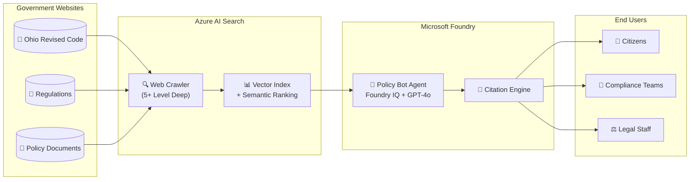
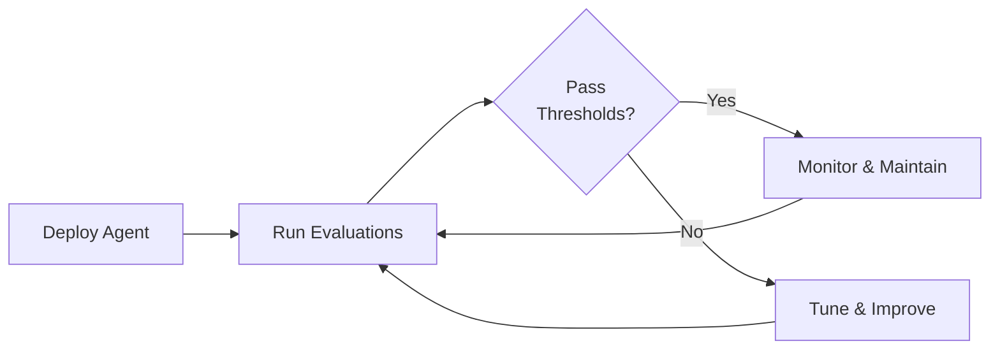

# Policy Bot 🏛️

> **AI-Powered Government Policy Assistant using Microsoft Foundry**

An intelligent agent that provides accurate, grounded answers from public government websites with reliable citations. Designed for organizations needing to query complex policy documents like the [Ohio Revised Code](https://codes.ohio.gov/ohio-revised-code).

---

## Executive Summary

### The Challenge

Organizations face significant challenges when researching government policies:

| Challenge | Impact |
|-----------|--------|
| **Deep Website Structures** | Government websites often have 5+ levels of nested content that traditional search cannot reach |
| **Hallucination Risk** | Generic AI models may fabricate policy information not found in actual documents |
| **Citation Reliability** | Users need exact references to verify information and make compliance decisions |

### The Solution

**Policy Bot** leverages Microsoft Foundry's no-code/low-code capabilities combined with Azure AI Search to create a reliable, citation-grounded policy assistant.



### Key Capabilities

| Capability | How It Works |
|------------|--------------|
| **Deep Web Crawling** | Azure AI Search web crawler configured for 5+ subdirectory levels, capturing nested policy structures |
| **Grounded Responses** | Foundry IQ with retrieval-augmented generation (RAG) ensures answers come ONLY from indexed documents |
| **Exact Citations** | Every response includes clickable references to source documents with exact quotes |

---

## Quick Start (< 30 minutes)

### Prerequisites

- Azure Subscription with Contributor access
- GitHub account
- Azure CLI installed ([install guide](https://docs.microsoft.com/cli/azure/install-azure-cli))

### Deploy in 4 Steps

```bash
# 1. Clone this repository
git clone https://github.com/ricardo-msft-SE/policybot1.git
cd policybot1

# 2. Login to Azure
az login

# 3. Deploy infrastructure
az deployment sub create \
  --location eastus2 \
  --template-file infra/main.bicep \
  --parameters resourceGroupName=rg-policybot

# 4. Configure the agent in Foundry Portal
# Follow: docs/deployment-guide.md
```

📖 **Detailed Instructions**: See [Deployment Guide](docs/deployment-guide.md)

---

## Repository Structure

```
policybot1/
├── README.md                    # This file (Executive Summary)
├── docs/
│   ├── architecture.md          # Technical architecture with diagrams
│   ├── deployment-guide.md      # Step-by-step deployment
│   ├── cost-estimation.md       # Azure cost scenarios
│   ├── evaluation-guide.md      # Measure and improve agent effectiveness
│   └── pain-points-addressed.md # Technical solutions to challenges
├── infra/
│   ├── main.bicep               # Main deployment template
│   └── modules/
│       ├── ai-search.bicep      # Azure AI Search configuration
│       ├── ai-foundry.bicep     # Microsoft Foundry resources
│       └── monitoring.bicep     # Application Insights
├── scripts/
│   ├── deploy.ps1               # PowerShell deployment script
│   ├── deploy.sh                # Bash deployment script
│   └── configure-crawler.ps1    # Web crawler setup
└── foundry/
    ├── agent-config.json        # Foundry agent configuration
    └── prompts/
        └── system-prompt.md     # Agent system instructions
```

---

## Documentation

| Document | Description |
|----------|-------------|
| [Architecture](docs/architecture.md) | Technical design, data flow, and component details |
| [Deployment Guide](docs/deployment-guide.md) | Step-by-step instructions for beginners |
| [Evaluation Guide](docs/evaluation-guide.md) | Measure agent accuracy, groundedness, and citation quality |
| [Cost Estimation](docs/cost-estimation.md) | Azure pricing for internal (1000 users) and public scenarios |
| [Pain Points Addressed](docs/pain-points-addressed.md) | How we solve deep search, grounding, and citations |

---

## Cost Overview

| Scenario | Monthly Estimate | Details |
|----------|------------------|---------|
| **Internal Team (1,000 users)** | ~$500 - $800/mo | Low-medium usage patterns |
| **Public Facing** | ~$2,000 - $5,000/mo | High availability, scale |

📊 **Full Breakdown**: See [Cost Estimation](docs/cost-estimation.md)

---

## Measuring Effectiveness

Policy Bot includes comprehensive evaluation capabilities to ensure accuracy:



| Metric | Target | Purpose |
|--------|--------|---------|
| **Groundedness** | ≥ 4.0/5.0 | Ensure answers come only from indexed documents |
| **Relevance** | ≥ 4.0/5.0 | Verify answers address the question |
| **Citation Accuracy** | ≥ 80% | Confirm citations are valid and useful |

📈 **Full Guide**: See [Evaluation Guide](docs/evaluation-guide.md)

---

## Technology Stack

| Component | Service | Purpose |
|-----------|---------|---------|
| **Agent Platform** | Microsoft Foundry + Foundry IQ | No-code agent creation and hosting |
| **Language Model** | Azure OpenAI (GPT-4o) | Natural language understanding |
| **Search & Indexing** | Azure AI Search | Web crawling, vector search, semantic ranking |
| **Monitoring** | Application Insights | Usage analytics and diagnostics |

---

## Support & Contributing

- **Issues**: [GitHub Issues](https://github.com/ricardo-msft-SE/policybot1/issues)
- **Discussions**: [GitHub Discussions](https://github.com/ricardo-msft-SE/policybot1/discussions)

---

## License

This project is licensed under the MIT License - see [LICENSE](LICENSE) for details.

---

<p align="center">
  <em>Built with ❤️ using Microsoft Foundry</em>
</p>
