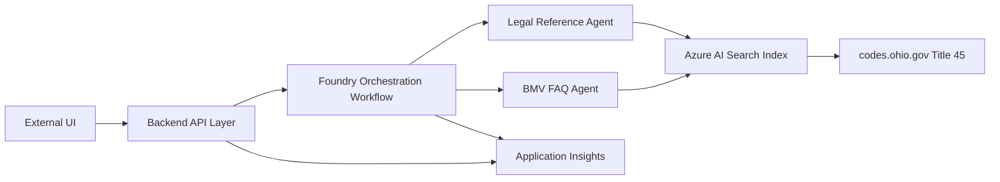
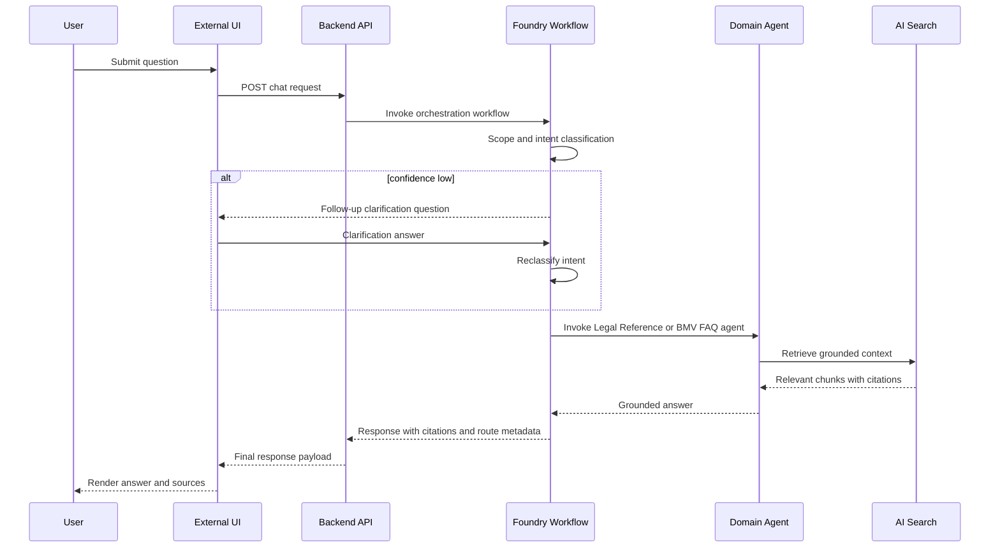

# Architecture
{: .no_toc }

## Table of contents
{: .no_toc .text-delta }

1. TOC
{:toc}

---

## Overview

The Policy Bot uses a **backend API plus workflow orchestration architecture** on Azure.
The external UI sends questions to a backend API endpoint, and the backend invokes a
Foundry workflow that classifies and routes queries to domain agents.

The runtime path is:

1. External UI receives the user question
2. Backend API validates input and applies security policy
3. Foundry workflow performs scope check, intent classification, and route decision
4. Workflow routes to either the Legal Reference Agent or BMV FAQ Agent
5. Workflow may ask follow-up clarification questions when confidence is low
6. Response is returned through the backend API with citations and telemetry



---

## Component Details

### External UI Layer

| Responsibility | Notes |
|----------------|-------|
| Collect user prompts | UI accepts free-text legal and procedural questions |
| Display response and citations | Shows answer plus source URLs |
| Avoid backend credentials | No direct Foundry or search credentials in client |

### Backend API Layer (Security Boundary)

| Responsibility | Notes |
|----------------|-------|
| Request validation | Input checks, scope heuristics, anti-abuse controls |
| Service-to-service auth | Managed Identity when calling Foundry services |
| Orchestration entry point | Invokes workflow and returns normalized response |
| No AI business logic | Backend does not perform legal reasoning itself |
| Telemetry | Emits request, latency, and error traces to Application Insights |

### Foundry Orchestration Workflow

The workflow handles intent-based routing and clarification behavior with explicit nodes.

| Node | Purpose |
|------|---------|
| Scope guard | Reject non-Title 45 questions |
| Intent classifier | Determine Legal Reference vs BMV FAQ intent |
| Confidence decision | Route immediately or ask follow-up question |
| Clarification handler | Ask user follow-up question and reclassify |
| Route executor | Invoke selected domain agent |
| Synthesis and citation check | Preserve citations and return grounded output |

### Domain Agents

| Agent | Primary use case | Notes |
|-------|------------------|-------|
| Legal Reference Agent | Statutory interpretation and section-specific legal questions | Grounded to Title 45 search index |
| BMV FAQ Agent | Operational and procedural BMV questions | Uses curated FAQ and policy content |

**Shared knowledge settings (all agents):**

| Setting | Value | Purpose |
|---------|-------|---------|
| Knowledge source | Azure AI Search | Grounds all legal responses |
| Query type | `vector_semantic_hybrid` | Best recall for legal language |
| Top K | `10` | Retrieve 10 most relevant chunks |
| Strictness | `4` | High confidence required before including a chunk |
| In scope only | ✅ | Cannot use model training knowledge |

### Azure AI Search

| Setting | Value |
|---------|-------|
| Index name | `ohio-title45-index` |
| Semantic config | `policy-semantic-config` |
| Embedding model | `text-embedding-3-small` |
| Crawler seed URL | `https://codes.ohio.gov/ohio-revised-code/title-45` |
| Crawler depth | 10 levels |
| Schedule | Weekly |
| SKU | Basic |

The index is populated using AI Search's built-in **"Import and vectorize data"** portal wizard.
No custom scraper code is required.

### Azure OpenAI / AI Services

| Resource | Deployment | SKU | Capacity | Used by |
|----------|-----------|-----|----------|---------|
| AI Services | `gpt-4o` | GlobalStandard | 30K TPM | Workflow and Legal Reference agent |
| AI Services | `gpt-4o-mini` | GlobalStandard | 30K TPM | BMV FAQ agent |
| AI Services | `text-embedding-3-small` | Standard | 120K TPM | AI Search vector indexing |

All four model deployments are created automatically by `scripts/bootstrap.ps1`.

### Backend Hosting

The backend API can be hosted in App Service, AKS, or another DPS-approved compute host.
This layer is the required security and orchestration boundary between client UI and Foundry.

### Monitoring

| Resource | Purpose |
|----------|---------|
| Application Insights | Request tracing, error logging, performance metrics |
| Log Analytics | Long-term log retention and KQL queries |

---

## Data Flow (Per Query)



If no chunks pass the strictness threshold, the workflow returns a grounded
"could not find" response instead of guessing.

---

## Infrastructure (Bicep)

```
infra/
  main.bicep                 ← root template, wires all modules
  modules/
    ai-services.bicep        ← Azure AI Services (kind=AIServices)
    foundry-project.bicep    ← Foundry Project (hub-less, kind=Project)
    ai-search.bicep          ← Azure AI Search (Basic SKU)
    openai.bicep             ← model deployments (gpt-4o, gpt-4o-mini, o3-mini, text-embedding-3-small)
    app-insights.bicep       ← Application Insights
    log-analytics.bicep      ← Log Analytics workspace
```

All resources deploy to resource group `rg-policybot` in `eastus2`.
The Foundry Project is provisioned by `scripts/bootstrap.ps1` after Bicep completes,
using `az ml workspace create --kind Project --hub-id <AI-Services-resource-ID>`.
No Hub workspace is created — this is the latest Azure AI Foundry architecture.

---

## Security

| Concern | Approach |
|---------|----------|
| Authentication | Entra ID and Managed Identity for service-to-service calls |
| Authorization | Azure RBAC — least privilege |
| Data boundary | All data stays within the Azure subscription |
| Content filtering | Azure OpenAI default content policy enabled |
| In-scope enforcement | Scope guard node plus `in_scope=true` grounding settings |

---

## Non-Goals

- No legal advice
- No transactions
- No database modifications
- No unrestricted internet knowledge as a source
- No autonomous agentic actions beyond response generation

---

## Scalability

| Component | Scaling Method |
|-----------|---------------|
| Backend API | App Service or AKS horizontal scaling |
| Foundry Workflow | Automatic (platform-managed) |
| AI Search | Manual replica count (up to 12 replicas on Standard) |
| Azure OpenAI | TPM quota — adjustable in AI Services |
| Client UI | Independent from backend and Foundry scaling |

---

## Next Steps

- [Deployment Guide]({{ site.baseurl }}/deployment-guide) — Deploy this architecture
- [Workflow Architecture]({{ site.baseurl }}/workflow-architecture-alternative) — Review workflow node-level routing and clarification behavior
- [Configuration Reference]({{ site.baseurl }}/configuration) — Tune agent and search settings
- [Cost Estimation]({{ site.baseurl }}/cost-estimation) — Understand pricing