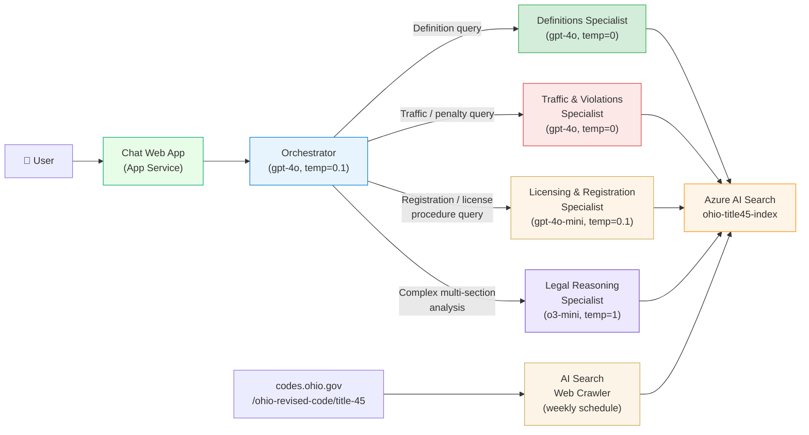
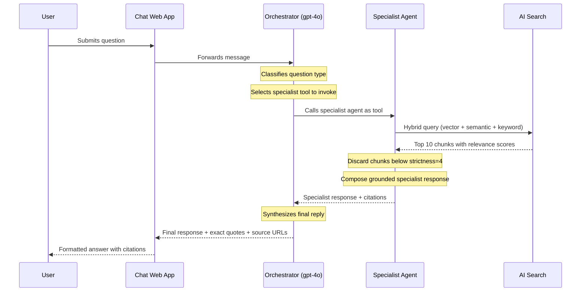

# Architecture
{: .no_toc }

## Table of contents
{: .no_toc .text-delta }

1. TOC
{:toc}

---

## Overview

The Policy Bot uses a **multi-agent Retrieval-Augmented Generation (RAG)** architecture built
entirely on Microsoft Azure AI Foundry. An **Orchestrator** classifies each user question and
routes it to the most appropriate **Specialist Agent**, each of which is tuned with a different
model and system prompt for its topic domain. All agents are grounded exclusively on
`ohio-title45-index` — they cannot draw on training knowledge for legal responses.



---

## Component Details

### Foundry Agents

All agents are created in the [ai.azure.com](https://ai.azure.com) portal. Configuration
reference: [`foundry/agent-config.json`](https://github.com/ricardo-msft-SE/policybot1/blob/main/foundry/agent-config.json).
System prompts: [`foundry/prompts/`](https://github.com/ricardo-msft-SE/policybot1/tree/main/foundry/prompts).

| Agent | Model | Temp | ORC Focus | System Prompt |
|-------|-------|------|-----------|---------------|
| **Orchestrator** | `gpt-4o` (2024-08-06) | 0.1 | All of Title 45 — routes + synthesizes | `orchestrator-prompt.md` |
| **Definitions Specialist** | `gpt-4o` (2024-08-06) | 0 | Chapter 4501 — verbatim definitions | `definitions-agent-prompt.md` |
| **Traffic & Violations Specialist** | `gpt-4o` (2024-08-06) | 0 | Chapter 4511 — penalties, OVI | `traffic-violations-agent-prompt.md` |
| **Licensing & Registration Specialist** | `gpt-4o-mini` (2024-07-18) | 0.1 | Chapters 4503, 4507 — procedures | `licensing-agent-prompt.md` |
| **Legal Reasoning Specialist** | `o3-mini` (2025-01-31) | 1* | Cross-chapter — complex analysis | `legal-reasoning-agent-prompt.md` |

*Temperature=1 is required for o3-mini (all OpenAI reasoning models).

**Shared knowledge settings (all agents):**

| Setting | Value | Purpose |
|---------|-------|---------|
| Knowledge source | Azure AI Search | Grounds all answers |
| Query type | `vector_semantic_hybrid` | Best recall for legal language |
| Top K | `10` | Retrieve 10 most relevant chunks |
| Strictness | `4` | High confidence required before including a chunk |
| In scope only | ✅ | Cannot use model training knowledge |

### Azure AI Search

| Setting | Value |
|---------|-------|
| Index name | `ohio-title45-index` |
| Semantic config | `policy-semantic-config` |
| Embedding model | `text-embedding-3-small` |
| Crawler seed URL | `https://codes.ohio.gov/ohio-revised-code/title-45` |
| Crawler depth | 10 levels |
| Schedule | Weekly |
| SKU | Basic |

The index is populated using AI Search's built-in **"Import and vectorize data"** portal wizard.
No custom scraper code is required.

### Azure OpenAI / AI Services

| Resource | Deployment | SKU | Capacity | Used by |
|----------|-----------|-----|----------|---------|
| AI Services | `gpt-4o` | GlobalStandard | 30K TPM | Orchestrator, Definitions, Traffic agents |
| AI Services | `gpt-4o-mini` | GlobalStandard | 30K TPM | Licensing & Registration agent |
| AI Services | `o3-mini` | GlobalStandard | 10K TPM | Legal Reasoning agent |
| AI Services | `text-embedding-3-small` | Standard | 120K TPM | AI Search vector indexing |

All four model deployments are created automatically by `scripts/bootstrap.ps1`.

### Chat Web App

Deployed directly from the Foundry Chat Playground via **Deploy → As a web app**.
Microsoft maintains this UI — updates and security patches are applied automatically.

### Monitoring

| Resource | Purpose |
|----------|---------|
| Application Insights | Request tracing, error logging, performance metrics |
| Log Analytics | Long-term log retention and KQL queries |

---

## Data Flow (Per Query)



If no chunks pass the strictness threshold, the specialist returns a scope disclaimer.
The Orchestrator forwards this disclaimer — it never adds information not present in
the retrieved content.

---

## Infrastructure (Bicep)

```
infra/
  main.bicep                 ← root template, wires all modules
  modules/
    ai-services.bicep        ← Azure AI Services (kind=AIServices)
    foundry-project.bicep    ← Foundry Project (hub-less, kind=Project)
    ai-search.bicep          ← Azure AI Search (Basic SKU)
    openai.bicep             ← model deployments (gpt-4o, gpt-4o-mini, o3-mini, text-embedding-3-small)
    app-insights.bicep       ← Application Insights
    log-analytics.bicep      ← Log Analytics workspace
```

All resources deploy to resource group `rg-policybot` in `eastus2`.
The Foundry Project is provisioned by `scripts/bootstrap.ps1` after Bicep completes,
using `az ml workspace create --kind Project --hub-id <AI-Services-resource-ID>`.
No Hub workspace is created — this is the latest Azure AI Foundry architecture.

---

## Security

| Concern | Approach |
|---------|----------|
| Authentication | Entra ID (DefaultAzureCredential) |
| Authorization | Azure RBAC — least privilege |
| Data boundary | All data stays within the Azure subscription |
| Content filtering | Azure OpenAI default content policy enabled |
| In-scope enforcement | `in_scope=true` on knowledge source + system prompt restriction |

---

## Scalability

| Component | Scaling Method |
|-----------|---------------|
| Foundry Agent | Automatic (platform-managed) |
| AI Search | Manual replica count (up to 12 replicas on Standard) |
| Azure OpenAI | TPM quota — adjustable in AI Services |
| Chat Web App | App Service plan scaling |

---

## Next Steps

- [Deployment Guide]({{ site.baseurl }}/deployment-guide) — Deploy this architecture
- [Configuration Reference]({{ site.baseurl }}/configuration) — Tune agent and search settings
- [Cost Estimation]({{ site.baseurl }}/cost-estimation) — Understand pricing