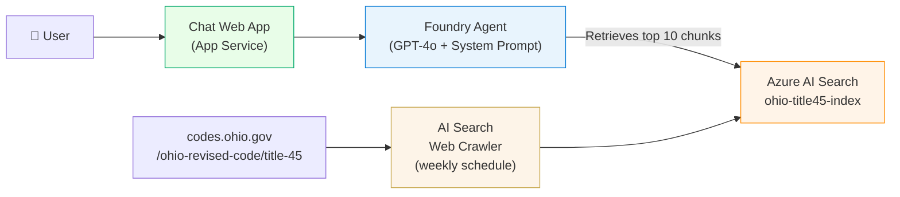
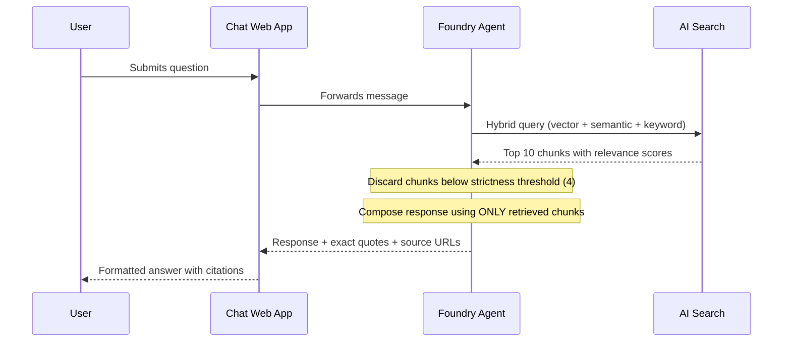

# Architecture
{: .no_toc }

## Table of contents
{: .no_toc .text-delta }

1. TOC
{:toc}

---

## Overview

The Policy Bot uses a **Retrieval-Augmented Generation (RAG)** architecture built entirely on
Microsoft Azure AI Foundry. The agent can only answer using documents retrieved from the AI
Search index — it cannot draw on GPT-4o's general training knowledge for legal questions.



---

## Component Details

### Foundry Agent

Created in the [ai.azure.com](https://ai.azure.com) portal. Configuration reference stored in
[`foundry/agent-config.json`](https://github.com/ricardo-msft-SE/policybot1/blob/main/foundry/agent-config.json).

| Setting | Value | Purpose |
|---------|-------|---------|
| Model | `gpt-4o` (2024-08-06) | High accuracy for legal text |
| Temperature | `0.1` | Low variance — factual responses only |
| Knowledge source | Azure AI Search | Grounds all answers |
| Query type | `vector_semantic_hybrid` | Best recall for legal language |
| Top K | `10` | Retrieve 10 most relevant chunks |
| Strictness | `4` | High confidence required before including a chunk |
| In scope only | ✅ | Cannot use GPT-4o's external training knowledge |

The system prompt is in [`foundry/prompts/system-prompt.md`](https://github.com/ricardo-msft-SE/policybot1/blob/main/foundry/prompts/system-prompt.md).
It enforces absolute scope restriction to Title 45 only, requiring exact quotes and source URLs in every response.

### Azure AI Search

| Setting | Value |
|---------|-------|
| Index name | `ohio-title45-index` |
| Semantic config | `policy-semantic-config` |
| Embedding model | `text-embedding-3-small` |
| Crawler seed URL | `https://codes.ohio.gov/ohio-revised-code/title-45` |
| Crawler depth | 10 levels |
| Schedule | Weekly |
| SKU | Basic |

The index is populated using AI Search's built-in **"Import and vectorize data"** portal wizard.
No custom scraper code is required.

### Azure OpenAI / AI Services

| Resource | Deployment | SKU | Capacity |
|----------|-----------|-----|----------|
| AI Services | `gpt-4o` | GlobalStandard | 30K TPM |
| AI Services | `text-embedding-3-small` | Standard | 120K TPM |

Both deployments are created automatically by `scripts/bootstrap.ps1`.

### Chat Web App

Deployed directly from the Foundry Chat Playground via **Deploy → As a web app**.
Microsoft maintains this UI — updates and security patches are applied automatically.

### Monitoring

| Resource | Purpose |
|----------|---------|
| Application Insights | Request tracing, error logging, performance metrics |
| Log Analytics | Long-term log retention and KQL queries |

---

## Data Flow (Per Query)



If no chunks pass the strictness threshold, the agent responds with a scope disclaimer
rather than generating an unsupported answer.

---

## Infrastructure (Bicep)

```
infra/
  main.bicep                 ← root template, wires all modules
  modules/
    ai-services.bicep        ← Azure AI Services (kind=AIServices)
    ai-search.bicep          ← Azure AI Search (Basic SKU)
    openai.bicep             ← model deployments (gpt-4o, text-embedding-3-small)
    app-insights.bicep       ← Application Insights
    log-analytics.bicep      ← Log Analytics workspace
```

All resources deploy to resource group `rg-policybot` in `eastus2`.
The Foundry Hub and Project are created by `scripts/bootstrap.ps1` after Bicep completes.

---

## Security

| Concern | Approach |
|---------|----------|
| Authentication | Entra ID (DefaultAzureCredential) |
| Authorization | Azure RBAC — least privilege |
| Data boundary | All data stays within the Azure subscription |
| Content filtering | Azure OpenAI default content policy enabled |
| In-scope enforcement | `in_scope=true` on knowledge source + system prompt restriction |

---

## Scalability

| Component | Scaling Method |
|-----------|---------------|
| Foundry Agent | Automatic (platform-managed) |
| AI Search | Manual replica count (up to 12 replicas on Standard) |
| Azure OpenAI | TPM quota — adjustable in AI Services |
| Chat Web App | App Service plan scaling |

---

## Next Steps

- [Deployment Guide]({{ site.baseurl }}/deployment-guide) — Deploy this architecture
- [Configuration Reference]({{ site.baseurl }}/configuration) — Tune agent and search settings
- [Cost Estimation]({{ site.baseurl }}/cost-estimation) — Understand pricing