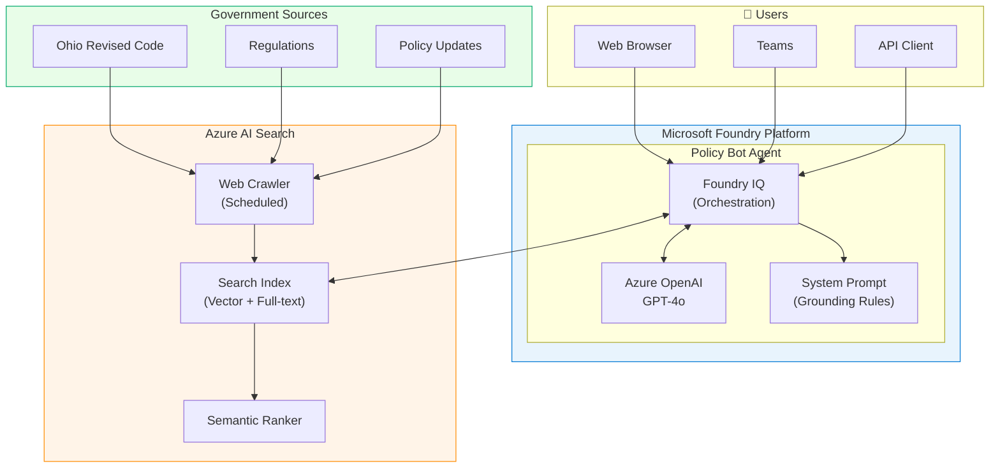
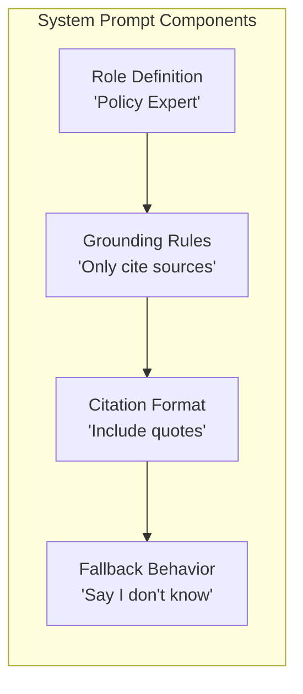
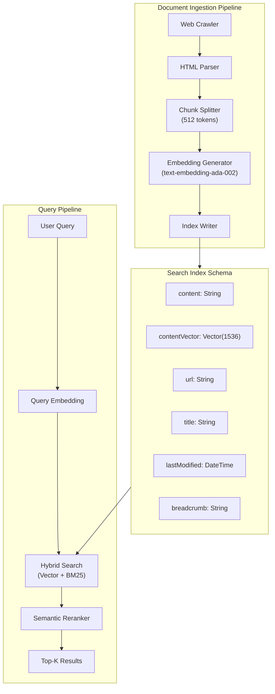
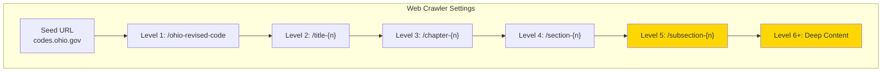
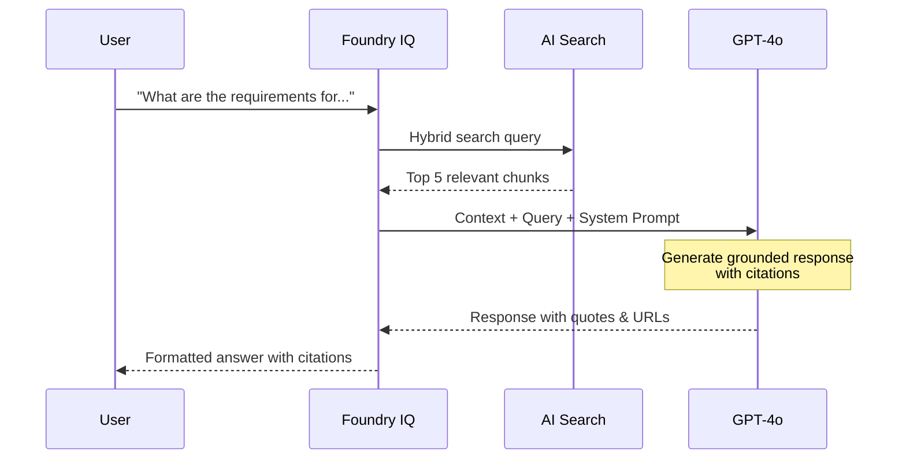
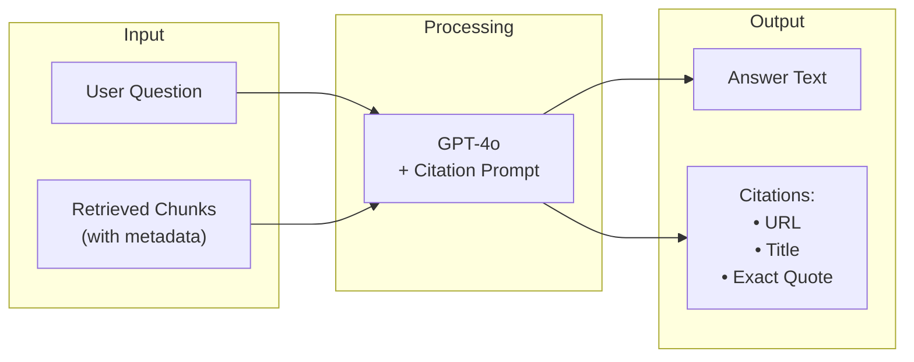
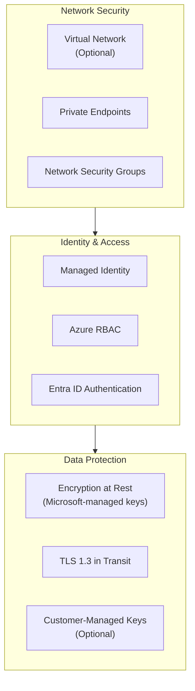
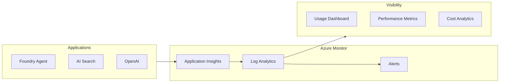

# Policy Bot Architecture

> Technical architecture documentation for the Policy Bot solution

---

## Overview

Policy Bot uses a **Retrieval-Augmented Generation (RAG)** architecture powered by Microsoft Foundry and Azure AI Search. This design ensures all responses are grounded in actual policy documents with verifiable citations.

---

## High-Level Architecture

---

## Component Details

### 1. Microsoft Foundry Agent

The core agent is built using **Foundry IQ** (no-code approach) with the following configuration:

| Configuration | Value | Purpose |
|--------------|-------|---------|
| **Agent Type** | Prompt Agent | Low-code, rapid deployment |
| **Model** | GPT-4o | High accuracy for policy interpretation |
| **Temperature** | 0.1 | Low creativity for factual responses |
| **Knowledge Source** | Azure AI Search | Grounded retrieval |

#### System Prompt Architecture

### 2. Azure AI Search

Handles document ingestion and intelligent retrieval:

#### Index Configuration

| Setting | Value | Rationale |
|---------|-------|-----------|
| **Chunking Size** | 512 tokens | Balance between context and precision |
| **Overlap** | 128 tokens | Maintain context across chunks |
| **Embedding Model** | text-embedding-ada-002 | Cost-effective, high quality |
| **Search Type** | Hybrid (Vector + Keyword) | Best recall for legal text |
| **Semantic Ranker** | Enabled | Improved relevance scoring |

### 3. Web Crawler Configuration

Designed for deep navigation of government websites:

| Setting | Value | Purpose |
|---------|-------|---------|
| **Max Depth** | 10 | Reach deeply nested content |
| **Crawl Scope** | `codes.ohio.gov/*` | Stay within domain |
| **Schedule** | Weekly | Keep content fresh |
| **Delay** | 1 second | Respectful crawling |

---

## Data Flow

### Query Processing Flow

### Citation Generation Flow

---

## Security Architecture

### Security Controls

| Control | Implementation | Notes |
|---------|---------------|-------|
| **Authentication** | Entra ID | Required for Foundry access |
| **Authorization** | Azure RBAC | Least privilege principle |
| **Network** | Public (default) or Private Endpoints | See enterprise deployment |
| **Data Encryption** | AES-256 | Automatic, no configuration needed |

---

## Scalability

### Load Handling

| Component | Scaling Method | Limits |
|-----------|---------------|--------|
| **Foundry Agent** | Automatic | Based on Foundry tier |
| **AI Search** | Manual (replica count) | Up to 12 replicas |
| **Azure OpenAI** | TPM (tokens per minute) | Configurable quota |

### Performance Targets

| Metric | Target | Notes |
|--------|--------|-------|
| **Response Time** | < 5 seconds | 95th percentile |
| **Availability** | 99.9% | Multi-region recommended for production |
| **Concurrent Users** | 100+ | Depends on tier |

---

## Monitoring & Observability

### Key Metrics

| Metric | Description | Alert Threshold |
|--------|-------------|-----------------|
| **Query Latency** | End-to-end response time | > 10 seconds |
| **Error Rate** | Failed requests percentage | > 1% |
| **Token Usage** | OpenAI consumption | > 80% quota |
| **Index Freshness** | Last successful crawl | > 7 days |

---

## Disaster Recovery

| Aspect | Strategy | RPO/RTO |
|--------|----------|---------|
| **Index Data** | Re-crawl from source | RPO: 7 days |
| **Configuration** | Infrastructure as Code (Bicep) | RPO: 0 |
| **Agent Settings** | Exported JSON configuration | RPO: 0 |

---

## Next Steps

- [Deployment Guide](deployment-guide.md) - Deploy this architecture
- [Cost Estimation](cost-estimation.md) - Understand pricing
- [Pain Points Addressed](pain-points-addressed.md) - Technical deep-dive
