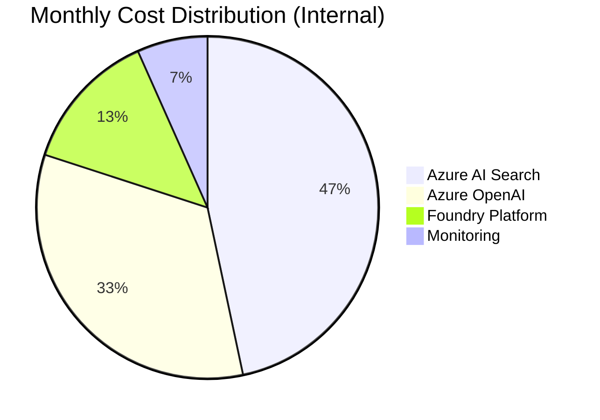
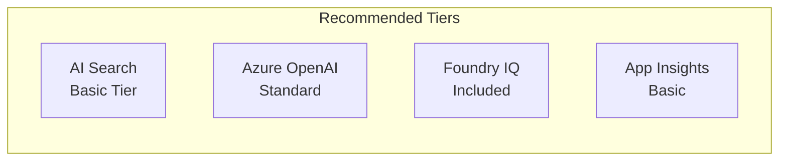
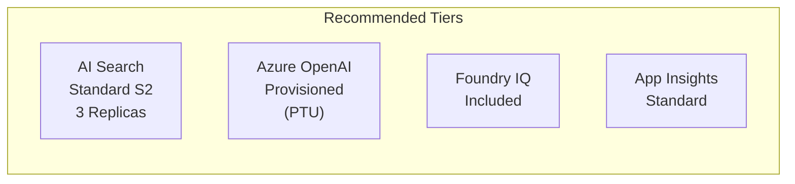
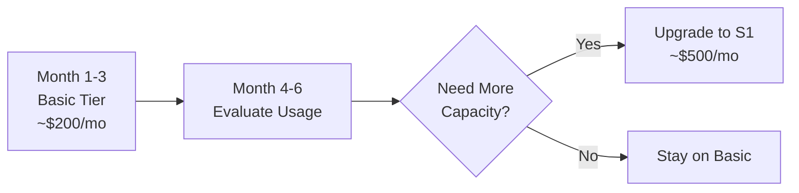

# Azure Cost Estimation

> Monthly cost scenarios for Policy Bot deployment

This document provides cost estimates for deploying and running Policy Bot in two scenarios:
1. **Internal Use**: 1,000-person organization
2. **Public Facing**: Citizen-facing portal

---

## Cost Summary



| Scenario | Monthly Estimate | Annual Estimate |
|----------|------------------|-----------------|
| **Internal (1,000 users)** | $500 - $800 | $6,000 - $9,600 |
| **Public Facing** | $2,000 - $5,000 | $24,000 - $60,000 |

---

## Scenario 1: Internal Organization (1,000 Users)

### Usage Assumptions

| Metric | Value | Rationale |
|--------|-------|-----------|
| Active users/day | 100 (10%) | Typical enterprise engagement |
| Queries per user | 5-10 | Research sessions |
| Avg. tokens per query | 2,000 | Question + context + response |
| Peak concurrent users | 20 | Morning/afternoon peaks |

### Resource Sizing



### Detailed Breakdown

#### Azure AI Search

| Configuration | Details | Monthly Cost |
|--------------|---------|--------------|
| **Tier** | Basic | $73.73 |
| **Replicas** | 1 | Included |
| **Partitions** | 1 | Included |
| **Storage** | 2 GB (15 GB included) | Included |
| **Semantic Ranker** | Free tier (1,000/month) | $0 |
| **Total** | | **~$75** |

If you need vector search:

| Configuration | Details | Monthly Cost |
|--------------|---------|--------------|
| **Tier** | Standard S1 | $250.40 |
| **Vector Search** | Included | $0 |
| **Semantic Ranker** | Standard (10K queries) | ~$30 |
| **Total** | | **~$280** |

#### Azure OpenAI (GPT-4o)

| Usage Type | Volume | Rate | Monthly Cost |
|------------|--------|------|--------------|
| **Input Tokens** | 10M tokens | $2.50/1M | $25 |
| **Output Tokens** | 3M tokens | $10.00/1M | $30 |
| **Embeddings** | One-time indexing | ~$5 | $5 (first month) |
| **Total** | | | **~$55-60** |

**Calculation:**
- 100 users × 7.5 queries × 2,000 tokens × 22 workdays = ~33M tokens/month
- Split: 75% input, 25% output

#### Microsoft Foundry

| Component | Cost |
|-----------|------|
| **Foundry IQ (Prompt Agent)** | Included with Azure OpenAI |
| **Project Hosting** | Free |
| **Portal Access** | Free |
| **Total** | **$0** |

#### Monitoring (Application Insights)

| Usage | Volume | Rate | Monthly Cost |
|-------|--------|------|--------------|
| **Data Ingestion** | 5 GB/month | First 5 GB free | $0 |
| **Retention** | 90 days | Included | $0 |
| **Total** | | | **$0** |

### Internal Scenario Total

| Component | Low Estimate | High Estimate |
|-----------|--------------|---------------|
| AI Search (Basic) | $75 | - |
| AI Search (Standard S1) | - | $280 |
| Azure OpenAI | $55 | $150 |
| Foundry Platform | $0 | $0 |
| Application Insights | $0 | $10 |
| **Monthly Total** | **$130** | **$440** |
| **With Buffer (1.5x)** | **$195** | **$660** |

> 💡 **Recommendation**: Start with Basic tier AI Search (~$200/month total) and upgrade if needed.

---

## Scenario 2: Public Facing Deployment

### Usage Assumptions

| Metric | Value | Rationale |
|--------|-------|-----------|
| Monthly visitors | 50,000 | Public government service |
| Queries per session | 3-5 | Quick lookups |
| Avg. tokens per query | 2,500 | Longer context needed |
| Peak concurrent users | 200 | Event-driven spikes |
| Availability SLA | 99.9% | Public service requirement |

### Resource Sizing



### Detailed Breakdown

#### Azure AI Search

| Configuration | Details | Monthly Cost |
|--------------|---------|--------------|
| **Tier** | Standard S2 | $503.36 |
| **Replicas** | 3 (for 99.9% SLA) | $1,510.08 |
| **Partitions** | 2 (60 GB storage) | $1,006.72 |
| **Semantic Ranker** | Standard (100K queries) | ~$300 |
| **Total** | | **~$2,320** |

> Note: 3 replicas required for 99.9% SLA guarantee

#### Azure OpenAI (GPT-4o)

**Option A: Pay-as-you-go**

| Usage Type | Volume | Rate | Monthly Cost |
|------------|--------|------|--------------|
| **Input Tokens** | 200M tokens | $2.50/1M | $500 |
| **Output Tokens** | 60M tokens | $10.00/1M | $600 |
| **Total** | | | **~$1,100** |

**Option B: Provisioned Throughput (PTU)**

| Configuration | Details | Monthly Cost |
|--------------|---------|--------------|
| **PTU Quantity** | 50 PTU | ~$1,500 |
| **Commitment** | Monthly | - |
| **Total** | | **~$1,500** |

> 💡 PTU recommended for predictable high-volume workloads

#### Monitoring & Security

| Component | Cost |
|-----------|------|
| **Application Insights** | $50-100 (10+ GB data) |
| **Azure Monitor Alerts** | $10 |
| **Log Analytics** | $50 |
| **Total** | **~$110-160** |

#### Optional: High Availability Add-ons

| Component | Purpose | Monthly Cost |
|-----------|---------|--------------|
| **Traffic Manager** | Multi-region failover | $20 |
| **Azure Front Door** | Global load balancing | $35+ |
| **Private Endpoints** | Enhanced security | $10/endpoint |

### Public Facing Scenario Total

| Component | Low Estimate | High Estimate |
|-----------|--------------|---------------|
| AI Search (S2, 3 replicas) | $1,800 | $2,500 |
| Azure OpenAI (Pay-as-you-go) | $500 | $1,500 |
| Azure OpenAI (PTU alternative) | $1,500 | $2,500 |
| Monitoring | $110 | $200 |
| High Availability | $0 | $200 |
| **Monthly Total** | **$2,410** | **$4,700** |
| **With Buffer (1.3x)** | **$3,133** | **$6,110** |

### Annual Budget (Public Facing)

| Component | Low Estimate | High Estimate |
|-----------|--------------|---------------|
| Monthly Cost (with buffer) | $3,133 | $6,110 |
| Annual Cost | **$37,596** | **$73,320** |

### Choosing Between Internal and Public Scenarios

| Factor | Internal Scenario | Public Facing Scenario |
|--------|-------------------|------------------------|
| Expected monthly queries | < 10,000 | > 100,000 |
| Availability target | Standard | High availability with failover |
| Search replicas | 1 | 3+ |
| Recommended starting monthly budget | ~$500 | ~$3,000 |

If traffic and availability needs are uncertain, start with the internal profile and scale up using observed usage metrics.

---

## Cost Comparison Chart

```mermaid
gantt
    title Monthly Cost Comparison
    dateFormat X
    axisFormat $%s
    
    section Internal
    AI Search (Basic)       :0, 75
    AI Search (S1)          :75, 280
    Azure OpenAI            :280, 440
    
    section Public
    AI Search (S2)          :0, 2500
    Azure OpenAI            :2500, 4000
    Monitoring              :4000, 4200
```



---

## Cost Optimization Strategies

### 1. Start Small, Scale Up



### 2. Optimize Token Usage

| Strategy | Savings |
|----------|---------|
| Cache frequent queries | 20-30% |
| Reduce context window | 10-20% |
| Use GPT-4o-mini for simple queries | 50%+ |

### 3. Right-size Search Index

| Action | Impact |
|--------|--------|
| Remove outdated documents | Reduce storage costs |
| Optimize chunk size | Better relevance, fewer calls |
| Schedule off-peak indexing | Avoid burst charges |

### 4. Monitor and Adjust

```bash
# Check actual usage
az consumption usage list \
  --resource-group rg-policybot \
  --start-date 2024-01-01 \
  --end-date 2024-01-31
```

---

## Free Tier Opportunities

| Service | Free Tier Allowance |
|---------|-------------------|
| **Azure AI Search** | Basic tier: First service is discounted |
| **Semantic Ranker** | 1,000 queries/month free |
| **Application Insights** | 5 GB data ingestion/month |
| **Azure Monitor** | Basic metrics free |
| **Foundry Portal** | No additional cost |

---

## Budget Planning Template

### Monthly Budget Worksheet

| Line Item | Estimated | Actual | Variance |
|-----------|-----------|--------|----------|
| Azure AI Search | $ | $ | $ |
| Azure OpenAI | $ | $ | $ |
| Monitoring | $ | $ | $ |
| Network/Egress | $ | $ | $ |
| **Total** | $ | $ | $ |

### Annual Budget (Internal)

| Quarter | Budget | Notes |
|---------|--------|-------|
| Q1 | $2,000 | Setup + indexing |
| Q2 | $1,500 | Normal operations |
| Q3 | $1,500 | Normal operations |
| Q4 | $2,000 | Re-indexing + scaling |
| **Annual** | **$7,000** | |

---

## Calculator Links

- [Azure Pricing Calculator](https://azure.microsoft.com/pricing/calculator/)
- [Azure OpenAI Pricing](https://azure.microsoft.com/pricing/details/cognitive-services/openai-service/)
- [Azure AI Search Pricing](https://azure.microsoft.com/pricing/details/search/)

---

## Cost Alerts Setup

```bicep
// Add to your Bicep deployment for cost monitoring
resource costAlert 'Microsoft.CostManagement/budgets@2023-11-01' = {
  name: 'policybot-monthly-budget'
  properties: {
    amount: 500
    category: 'Cost'
    timeGrain: 'Monthly'
    timePeriod: {
      startDate: '2024-01-01'
    }
    notifications: {
      alert80percent: {
        enabled: true
        threshold: 80
        operator: 'GreaterThan'
        contactEmails: ['admin@company.com']
      }
    }
  }
}
```

---

## Related Documentation

- [Architecture](architecture.md) - Resource specifications
- [Deployment Guide](deployment-guide.md) - Deploy these resources
- [Pain Points Addressed](pain-points-addressed.md) - Why these services
