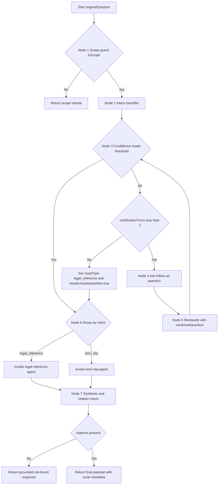

# Deployment Guide
{: .no_toc }

Deployment follows a **backend API plus Foundry workflow** pattern. After infrastructure deploys,
configure backend API integration, index grounding data, create two domain agents, and wire the
workflow router.

## Table of contents
{: .no_toc .text-delta }

1. TOC
{:toc}

---

## Prerequisites

| Requirement | How to Verify |
|-------------|---------------|
| Azure subscription (Contributor role) | `az account show` |
| Azure CLI installed | `az --version` |
| PowerShell 7+ | `$PSVersionTable.PSVersion` |
| Subscription ID | `{YOUR_SUBSCRIPTION_ID}` from `az account show --query id -o tsv` |

---

## Step 1 — Deploy Azure Infrastructure

This is the only automated step. It deploys all Azure resources and creates the Foundry
Project (hub-less — the new Azure AI Foundry model).

```powershell
# From the repo root
git clone https://github.com/ricardo-msft-SE/policybot1.git
cd policybot1

az login
.\scripts\bootstrap.ps1
```

What `bootstrap.ps1` creates:

- Resource group `rg-policybot` in `eastus2`
- Azure AI Services with `gpt-4o` and `text-embedding-3-small` deployments
- Azure AI Search (Basic SKU)
- Application Insights + Log Analytics workspace
- **Foundry Project** (`policybot-project`) linked directly to AI Services — no Hub workspace required
- AI Search connection (`aisearch-conn`) registered on the Project
- Baseline services used by backend API and workflow orchestration

When it finishes, the script prints a **configuration summary** with endpoints — keep this
window open for the next steps.

{: .note }
To skip infrastructure if already deployed: `.\scripts\bootstrap.ps1 -SkipInfra`

---

## Step 2 — Deploy Backend API Layer

Deploy or configure the backend API as the orchestration and security boundary.

Required backend responsibilities:

- Receive prompt payload from UI
- Validate and sanitize request data
- Authenticate to Foundry using Managed Identity
- Invoke the workflow endpoint
- Return normalized response with citations and routing metadata
- Emit telemetry to Application Insights

Recommended endpoint contract:

```json
POST /api/chat
{
   "question": "string",
   "sessionId": "string",
   "userId": "string"
}
```

```json
200 OK
{
   "answer": "string",
   "citations": [],
   "routeType": "legal_reference|bmv_faq",
   "clarificationAsked": true
}
```

### API Contract Details

#### Request validation

| Field | Constraints | Notes |
|-------|-------------|-------|
| `question` | Max 2000 chars | Reject larger payloads with 400 |
| `sessionId` | UUID or stable string ID | Required to track clarification loops |
| `userId` | Max 100 chars | Use pseudonymous ID where possible |

#### Response codes

| Code | Condition | Example response |
|------|-----------|------------------|
| 200 | Success | `{"answer":"...","citations":[],"routeType":"legal_reference"}` |
| 400 | Invalid input | `{"error":"invalid_request","detail":"question exceeds 2000 chars"}` |
| 401 | Auth failure | `{"error":"invalid_gateway_credentials"}` |
| 503 | Workflow timeout | `{"error":"workflow_timeout","retryAfter":30}` |

#### Clarification response shape

When the workflow asks a follow-up question, return a structured payload:

```json
{
   "clarificationAsked": true,
   "clarificationQuestion": "Are you asking about what the law says, or about BMV process steps?",
   "sessionId": "<same-session-id>",
   "routeType": "pending"
}
```

{: .warning }
Keep AI logic in Foundry workflow and domain agents. The backend API should not perform
legal reasoning.

---

## Step 3 — Index Ohio Revised Code Title 45

Use the Azure AI Search portal wizard to crawl and vectorize Title 45. No scraper code needed.

{: .important }
AI Search is the recommended grounding source for this solution because legal answers require
stable retrieval, strict corpus boundaries, and repeatable citation behavior.
See [Appendix - AI Search vs Bing Custom Grounding]({{ site.baseurl }}/appendix-ai-search-vs-bing-grounding)
for trade-offs.

1. Open [portal.azure.com](https://portal.azure.com) and navigate to your **AI Search** resource (`search-policybot-*`)
2. Click **"Import and vectorize data"**
3. **Data source**: Select **Web** → enter seed URL:
   ```
   https://codes.ohio.gov/ohio-revised-code/title-45
   ```
4. **Parsing mode**: HTML
5. **Crawler settings**: Depth = `10`, include subpages ✅
6. **Vectorize text**: Select your **AI Services** resource → deployment `text-embedding-3-small`
7. **Index name**: `ohio-title45-index`
8. **Semantic configuration name**: `policy-semantic-config`
9. Click **Create**

The indexer runs immediately. Expect **10–30 minutes** for the full site crawl.

**Verify:** AI Search resource → **Indexers** → `ohio-title45-indexer` → document count should be > 0.

Recommended production profile for this use case:

| Setting | Value | Why |
|--------|-------|-----|
| Query mode | `vector_semantic_hybrid` | Hybrid precision for legal text |
| Strictness | `4` | Reduces weak-context responses |
| Top K | `10` | Enough context for section-level answers |
| In-scope | `true` | Enforces domain boundary |
| Semantic config | `policy-semantic-config` | Better relevance for statutory language |

{: .note }
To schedule automatic weekly re-indexing: open the indexer → **Settings** → **Schedule** → Weekly.

### Alternative (Scripted)

If the portal wizard is unavailable or the site blocks the portal crawler, use the provided scripts:

```powershell
# Set environment variables printed by bootstrap.ps1, then:
python scripts\configure-search.py create-index

.\scripts\configure-crawler.ps1 `
  -ResourceGroupName "rg-policybot" `
  -SearchServiceName "search-policybot-XXXX" `
  -IndexName "ohio-title45-index" `
  -SeedUrl "https://codes.ohio.gov/ohio-revised-code/title-45" `
  -CrawlDepth 10
```

---

## Step 4 — Create the Foundry Domain Agents

Create two domain agents first. The workflow router references these agents.

> **Open:** [ai.azure.com](https://ai.azure.com) → Project **`policybot-project`** → **Agents** → **New agent**

### 4a. Primary Agent — Legal Reference

| Field | Value |
|-------|-------|
| Name | `legal-reference-agent` |
| Model | `gpt-4o` |
| Temperature | `0.1` |

Configure grounding:

| Field | Value |
|-------|-------|
| Connection | `aisearch-conn` |
| Index | `ohio-title45-index` |
| Search type | `Hybrid (vector + keyword)` |
| Semantic ranker | `policy-semantic-config` |
| Top K | `10` |
| Strictness | `4` |
| In scope only | ✅ Enabled |

### 4b. Secondary Agent — BMV FAQ

| Field | Value |
|-------|-------|
| Name | `bmv-faq-agent` |
| Model | `gpt-4o-mini` |
| Temperature | `0.1` |

Use BMV operational content and policy FAQ material for this agent's knowledge source.

---

## Step 5 — Configure Foundry Workflow Router

Build the workflow in this exact order so routing is deterministic and easy to test.

### 5.1 Define workflow state variables

Create and initialize these state variables at workflow start:

| Variable | Type | Initial value | Purpose |
|----------|------|---------------|---------|
| `originalQuestion` | string | user prompt | Preserve original input |
| `clarificationAnswer` | string | `""` | Store follow-up response |
| `combinedQuestion` | string | `originalQuestion` | Input for classification after clarification |
| `intent` | string | `"unknown"` | `legal_reference` or `bmv_faq` |
| `confidence` | number | `0` | Classifier confidence score |
| `clarificationTurns` | number | `0` | Guardrail against infinite loops |
| `routeType` | string | `"unrouted"` | Final selected route |
| `needsUncertaintyNote` | bool | `false` | Mark unresolved ambiguity |

### 5.1a Workflow decision flow



### 5.2 Node 1 — Scope guard

**Goal:** reject non-Title 45 questions before any agent invocation.

Configuration:

- Input: `combinedQuestion`
- Output schema: `{ inScope: boolean, reason: string }`
- Decision rule:
   - If `inScope == false`, return scope refusal payload and end workflow
   - If `inScope == true`, continue to Node 2

Recommended refusal template:

> I can only answer questions about Ohio Revised Code Title 45 (Motor Vehicles).
> For other legal topics please consult codes.ohio.gov or a qualified attorney.

### 5.3 Node 2 — Intent classifier

**Goal:** classify query into one of two routes.

Configuration:

- Input: `combinedQuestion`
- Allowed labels:
   - `legal_reference`
   - `bmv_faq`
- Output schema: `{ intent: string, confidence: number }`

Store outputs into state variables `intent` and `confidence`.

### 5.4 Node 3 — Confidence decision

**Goal:** decide direct route vs clarification.

Recommended threshold:

- `confidenceThreshold = 0.75`

Branch conditions:

- If `confidence >= 0.75` → direct route to Node 6
- If `confidence < 0.75` and `clarificationTurns < 2` → Node 4 (clarification)
- If `confidence < 0.75` and `clarificationTurns >= 2`:
   - Set `routeType = "legal_reference"`
   - Set `needsUncertaintyNote = true`
   - Route to Node 6

### 5.5 Node 4 — Clarification question

**Goal:** ask one targeted follow-up question to improve routing confidence.

Configuration:

- Increment `clarificationTurns = clarificationTurns + 1`
- Ask one concise follow-up such as:
   - "Are you asking about what the law says, or about BMV process steps?"
- Save response in `clarificationAnswer`
- Update `combinedQuestion = originalQuestion + "\nClarification: " + clarificationAnswer`

Then continue to Node 5.

### 5.6 Node 5 — Reclassification

**Goal:** re-run classification on disambiguated context.

Configuration:

- Input: `combinedQuestion`
- Output: `{ intent, confidence }`
- Overwrite state values `intent` and `confidence`

Loop back to Node 3 (Confidence decision).

### 5.7 Node 6 — Agent invoke

**Goal:** call the selected domain agent.

Routing map:

- If `intent == "legal_reference"` or `routeType == "legal_reference"` fallback flag is set
   - Invoke `legal-reference-agent`
- If `intent == "bmv_faq"`
   - Invoke `bmv-faq-agent`

Set `routeType` to the actual invoked route.

### 5.8 Node 7 — Synthesis and citation check

**Goal:** normalize output and enforce grounded response requirements.

Required output contract:

```json
{
   "answer": "string",
   "citations": [],
   "routeType": "legal_reference|bmv_faq",
   "confidence": 0.0,
   "clarificationAsked": false,
   "needsUncertaintyNote": false
}
```

Validation gates:

- If `citations.length == 0`, return grounded not-found response
- If `needsUncertaintyNote == true`, append explicit uncertainty statement
- Preserve all source URLs returned by the agent

### 5.9 Clarification policy guardrails

- Allow at most **2** clarification turns per request
- Ask only routing-oriented questions (no legal advice content)
- If ambiguity remains after max turns, force `legal_reference` route with uncertainty note
- Always preserve route metadata for telemetry

### 5.10 Acceptance tests for Step 5

| Input | Expected behavior |
|------|--------------------|
| "What are OVI penalties under ORC?" | `legal_reference`, no clarification |
| "How do I renew plates at BMV?" | `bmv_faq`, no clarification |
| "Can you help with my driving issue?" | Clarification asked, then routed |
| "What is the capital of France?" | Scope refusal at Node 1 |
| Low-confidence ambiguous prompt after 2 clarifications | Forced `legal_reference` + uncertainty note |

---

## Step 6 — Test in the Playground and API

Test both workflow behavior and backend API behavior.

Open the workflow entry point and click **"Try in playground"**.
Test with these sample questions:

| Question | Expected routing + behavior |
|----------|-----------------------------|
| *"What does ORC say about OVI penalties?"* | Route to `legal-reference-agent` |
| *"How do I renew my license at BMV?"* | Route to `bmv-faq-agent` |
| *"Can you help me with this driving issue?"* | Clarification question asked before routing |
| *"What is the capital of France?"* | Scope refusal |

**Signs the workflow system is configured correctly:**
- ✅ Workflow shows node-by-node route decisions in trace/activity
- ✅ Low-confidence prompts trigger follow-up clarification question
- ✅ Follow-up response causes reclassification and final route selection
- ✅ Responses include exact quotes and `codes.ohio.gov` source URLs
- ✅ Off-topic questions are declined before agent invocation

Also test the backend endpoint directly and confirm route metadata is present in payload.

---

## Step 7 — Deploy or Integrate Client UI

1. Configure the UI to call backend endpoint `POST /api/chat`
2. Ensure no Foundry credentials are present in client code
3. Verify UI can render:

   - Answer text
   - Citations and source URLs
   - Clarification prompts from workflow

Optional: deploy Foundry-provided web app for demonstration environments.

---

## Step 8 — Enable Observability

In Application Insights, track:

- request count and latency by route type
- clarification question rate
- out-of-scope refusal rate
- citation completeness failures
- workflow node errors

Create alerts:

1. **Workflow failure alert**
   - Signal: Failed requests / exceptions
   - Threshold: > 5 failures in 15 minutes
2. **Latency alert**
   - Signal: P95 request duration
   - Threshold: > 4 seconds for 15 minutes
3. **Clarification spike alert**
   - Signal: clarificationAsked=true ratio
   - Threshold: > 40% over 30 minutes

Useful KQL queries:

```kusto
requests
| where timestamp > ago(24h)
| summarize count(), p95=percentile(duration,95) by tostring(customDimensions.routeType)
```

```kusto
customEvents
| where timestamp > ago(24h)
| where name == "WorkflowDecision"
| summarize clarifications=sum(toint(customDimensions.clarificationAsked)), total=count()
| extend clarificationRate = todouble(clarifications) / todouble(total)
```

```kusto
customEvents
| where timestamp > ago(24h)
| where name == "ResponseValidation"
| summarize missingCitations=countif(tostring(customDimensions.citationsPresent) == "false")
```

---

## Keeping the Knowledge Base Current

When codes.ohio.gov publishes updates to Title 45:

1. Go to AI Search → **Indexers** → `ohio-title45-indexer`
2. Click **Run** to trigger an immediate re-crawl

If weekly scheduling is configured in Step 2, this happens automatically.

---

## Troubleshooting

| Symptom | Likely Cause | Fix |
|---------|-------------|-----|
| Agent answers from general knowledge (no citations) | `In scope only` is off | Re-check knowledge source settings |
| "I couldn't find" for valid Title 45 questions | Index not populated | Check indexer status; wait for crawl to finish |
| Backend API returns 401 to Foundry | Managed Identity or RBAC missing | Reconfigure identity and role assignments |
| Clarification never appears | Confidence threshold too low | Increase threshold in workflow decision node |
| Workflow always asks follow-up | Threshold too high | Lower threshold and retest with sample prompts |
| Indexer shows 0 documents | Site blocked portal crawler | Use `configure-crawler.ps1` script alternative |
| `bootstrap.ps1` fails at model deployment | TPM quota limit | Reduce capacity or switch `Location` to another region |
| Agent not found in Foundry portal | Wrong project selected | Ensure `policybot-project` is selected |
| `az ml workspace create` fails on hub-less | Old az ml extension | Run `az extension update --name ml` |
| Wrong route selected | Classifier prompt or examples insufficient | Add classifier examples and retest |
