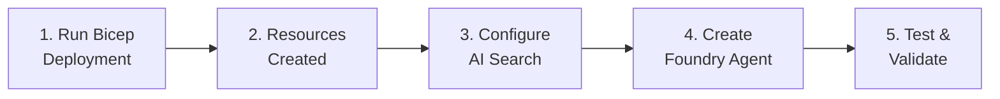
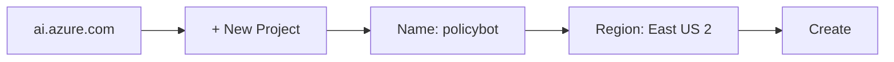
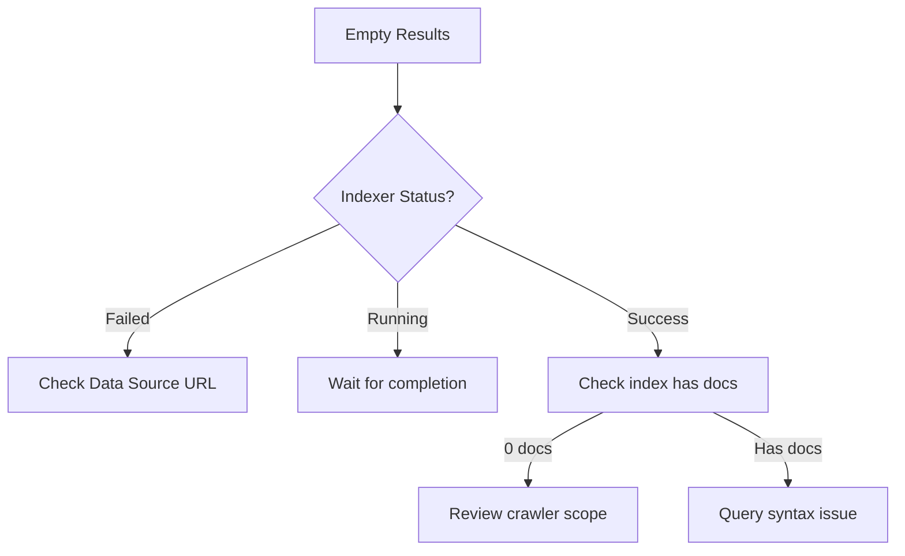

# Deployment Guide

> Step-by-step instructions for deploying Policy Bot to Azure

This guide is designed for beginners (100-level). Each step includes explanations and verification commands.

---

## Table of Contents

1. [Prerequisites](#prerequisites)
2. [Azure Setup](#azure-setup)
3. [Deploy Infrastructure](#deploy-infrastructure)
4. [Configure Azure AI Search](#configure-azure-ai-search)
5. [Create the Foundry Agent](#create-the-foundry-agent)
6. [Test Your Agent](#test-your-agent)
7. [Troubleshooting](#troubleshooting)

---

## Prerequisites

Before starting, ensure you have:

| Requirement | How to Verify | Installation |
|-------------|---------------|--------------|
| **Azure Subscription** | Access [Azure Portal](https://portal.azure.com) | [Create free account](https://azure.microsoft.com/free/) |
| **Azure CLI** | `az --version` | [Install guide](https://docs.microsoft.com/cli/azure/install-azure-cli) |
| **Git** | `git --version` | [Download Git](https://git-scm.com/downloads) |
| **Contributor Role** | `az role assignment list --assignee $(az ad signed-in-user show --query id -o tsv)` | Contact Azure admin |

---

## Azure Setup

### Step 1: Clone the Repository

```bash
# Clone Policy Bot repository
git clone https://github.com/ricardo-msft-SE/policybot1.git
cd policybot1
```

### Step 2: Login to Azure

```bash
# Interactive login
az login

# Set your subscription (if you have multiple)
az account list --output table
az account set --subscription "Your Subscription Name"

# Verify
az account show --query name -o tsv
```

### Step 3: Register Required Providers

Azure requires certain resource providers to be registered before use:

```bash
# Register required providers
az provider register --namespace Microsoft.Search
az provider register --namespace Microsoft.CognitiveServices
az provider register --namespace Microsoft.Web
az provider register --namespace Microsoft.Insights

# Verify registration (may take 1-2 minutes)
az provider show --namespace Microsoft.Search --query "registrationState" -o tsv
# Should output: Registered
```

---

## Deploy Infrastructure

### Deployment Flow



### Step 4: Deploy with Bicep

```bash
# Set variables
RESOURCE_GROUP="rg-policybot"
LOCATION="eastus2"  # Choose: eastus, eastus2, westus2, westeurope

# Create resource group
az group create --name $RESOURCE_GROUP --location $LOCATION

# Deploy infrastructure
az deployment group create \
  --resource-group $RESOURCE_GROUP \
  --template-file infra/main.bicep \
  --parameters location=$LOCATION

# Verify deployment
az resource list --resource-group $RESOURCE_GROUP --output table
```

**Expected Output:**

| Name | Type | Location |
|------|------|----------|
| search-policybot-xxx | Microsoft.Search/searchServices | eastus2 |
| aoai-policybot-xxx | Microsoft.CognitiveServices/accounts | eastus2 |
| appi-policybot-xxx | Microsoft.Insights/components | eastus2 |

### Alternative: One-Click Deploy

[](https://portal.azure.com/#create/Microsoft.Template/uri/https%3A%2F%2Fraw.githubusercontent.com%2Fricardo-msft-SE%2Fpolicybot1%2Fmain%2Finfra%2Fmain.json)

---

## Configure Azure AI Search

### Step 5: Create the Search Index

Navigate to Azure Portal → Your Search Service → **Indexes** → **Add index**

Or use the CLI:

```bash
# Get search service name
SEARCH_NAME=$(az search service list -g $RESOURCE_GROUP --query "[0].name" -o tsv)

# Get admin key
SEARCH_KEY=$(az search admin-key show \
  --resource-group $RESOURCE_GROUP \
  --service-name $SEARCH_NAME \
  --query "primaryKey" -o tsv)

echo "Search Service: $SEARCH_NAME"
echo "Admin Key: $SEARCH_KEY"
```

### Step 6: Configure the Web Crawler

Use the Azure Portal for the easiest experience:

1. **Navigate**: Azure Portal → AI Search → Your Service → **Data Sources**

2. **Add Data Source**:
   
   ```mermaid
   flowchart TB
       A["Click 'Import Data'"] --> B["Select 'Web content'"]
       B --> C["Enter Configuration"]
       C --> D["Create Index"]
       D --> E["Create Indexer"]
   ```

3. **Configuration Values**:

   | Field | Value | Notes |
   |-------|-------|-------|
   | **Seed URL** | `https://codes.ohio.gov/ohio-revised-code` | Starting point |
   | **Crawl Depth** | `10` | Captures 5+ levels |
   | **Restrict to Path** | `codes.ohio.gov/*` | Stay on domain |
   | **Crawl Schedule** | Weekly | Keep content fresh |

4. **Index Schema** (create these fields):

   | Field Name | Type | Searchable | Filterable | Retrievable |
   |-----------|------|------------|------------|-------------|
   | `id` | Edm.String | ❌ | ❌ | ✅ |
   | `content` | Edm.String | ✅ | ❌ | ✅ |
   | `url` | Edm.String | ❌ | ✅ | ✅ |
   | `title` | Edm.String | ✅ | ✅ | ✅ |
   | `lastModified` | Edm.DateTimeOffset | ❌ | ✅ | ✅ |

### Step 7: Enable Vector Search (Recommended)

For better semantic understanding:

1. **Navigate**: AI Search → Index → **Vector Search**

2. **Add Vector Configuration**:
   
   ```json
   {
     "vectorSearch": {
       "algorithms": [{
         "name": "hnsw-config",
         "kind": "hnsw",
         "hnswParameters": {
           "metric": "cosine",
           "m": 4,
           "efConstruction": 400,
           "efSearch": 500
         }
       }],
       "profiles": [{
         "name": "vector-profile",
         "algorithm": "hnsw-config",
         "vectorizer": "text-embedding-ada-002"
       }]
     }
   }
   ```

### Step 8: Enable Semantic Ranking

1. **Navigate**: AI Search → **Semantic Configurations**

2. **Create Configuration**:
   
   | Setting | Value |
   |---------|-------|
   | **Configuration Name** | `policy-semantic` |
   | **Title Field** | `title` |
   | **Content Fields** | `content` |

3. **Enable**: Set semantic search to "Free" or "Standard" tier

---

## Create the Foundry Agent

### Step 9: Access Microsoft Foundry

1. Navigate to [AI Foundry Portal](https://ai.azure.com)
2. Sign in with your Azure account
3. Select your subscription

### Step 10: Create Foundry Project (if needed)



### Step 11: Create the Policy Bot Agent

1. **Navigate**: Foundry Portal → Your Project → **Agents**

2. **Click**: **+ New Agent**

3. **Configure Agent**:

   | Setting | Value |
   |---------|-------|
   | **Name** | `policy-bot` |
   | **Type** | Prompt Agent |
   | **Model** | GPT-4o |
   | **Temperature** | 0.1 |

4. **Add Knowledge Source**:
   
   - Click **+ Add Knowledge**
   - Select **Azure AI Search**
   - Connect to your search service
   - Select your index

5. **Configure System Prompt**:
   
   Copy the content from [foundry/prompts/system-prompt.md](../foundry/prompts/system-prompt.md):

   ```markdown
   You are Policy Bot, an expert assistant for government policy research.
   
   ## Core Rules
   
   1. **ONLY use information from the provided search results**
   2. **NEVER make up or assume policy information**
   3. **Always cite your sources with exact quotes**
   
   ## Citation Format
   
   For every claim, include:
   - The exact quote from the source
   - The source URL
   - The relevant section/title
   
   Example response format:
   
   According to Ohio Revised Code Section 4511.01:
   > "Vehicle means every device, including a motorized bicycle and 
   > an electric bicycle, in, upon, or by which any person or property 
   > may be transported..."
   
   Source: https://codes.ohio.gov/ohio-revised-code/section-4511.01
   
   ## When You Don't Know
   
   If the search results don't contain relevant information, say:
   "I couldn't find specific information about [topic] in the indexed 
   policy documents. Please try rephrasing your question or verify 
   this topic is covered in the Ohio Revised Code."
   ```

### Step 12: Test the Agent

1. **Use the Chat Interface**: Type a test question
   
   ```
   What is the legal definition of a vehicle in Ohio?
   ```

2. **Verify Response Contains**:
   - ✅ Direct answer
   - ✅ Exact quote from source
   - ✅ URL citation
   - ✅ Section reference

---

## Test Your Agent

### Manual Testing Checklist

| Test Case | Expected Behavior | Pass? |
|-----------|-------------------|-------|
| Simple question | Grounded answer with citation | ☐ |
| Complex legal question | Multi-source answer | ☐ |
| Question not in sources | "I don't know" response | ☐ |
| Follow-up question | Context maintained | ☐ |

### Sample Test Questions

```
1. What are the requirements for vehicle registration in Ohio?

2. How does Ohio law define "reckless operation"?

3. What is the penalty for driving without insurance?

4. [Out of scope] What is the capital of France?
   Expected: "I couldn't find information about this topic..."
```

---

## Troubleshooting

### Common Issues

#### Issue: "Search results are empty"



**Solution:**
```bash
# Check indexer status
az search indexer show \
  --resource-group $RESOURCE_GROUP \
  --service-name $SEARCH_NAME \
  --name "your-indexer-name"
```

#### Issue: "Agent not grounding responses"

**Causes:**
1. Knowledge source not connected
2. System prompt missing grounding rules
3. Temperature too high

**Solution:**
1. Verify knowledge source in agent settings
2. Re-apply system prompt from template
3. Set temperature to 0.1 or lower

#### Issue: "Deployment failed"

```bash
# Check deployment errors
az deployment group show \
  --resource-group $RESOURCE_GROUP \
  --name "main" \
  --query "properties.error"
```

Common causes:
- Quota exceeded (request increase)
- Region not available (try different region)
- Name conflicts (use unique suffix)

---

## Next Steps

✅ **Deployment Complete!**

- [Architecture Documentation](architecture.md) - Understand how it works
- [Cost Estimation](cost-estimation.md) - Plan your budget
- [Pain Points Addressed](pain-points-addressed.md) - Technical deep-dive

---

## Quick Reference

### Resource Names

After deployment, find your resources:

```bash
# List all resources
az resource list -g $RESOURCE_GROUP -o table

# Get connection strings
az search service show -g $RESOURCE_GROUP -n $SEARCH_NAME
```

### Useful Links

| Resource | URL |
|----------|-----|
| Azure Portal | https://portal.azure.com |
| AI Foundry | https://ai.azure.com |
| Azure AI Search | https://portal.azure.com/#blade/HubsExtension/BrowseResource/resourceType/Microsoft.Search%2FsearchServices |
| Documentation | https://learn.microsoft.com/azure/ai-services/ |
