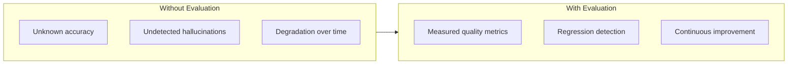
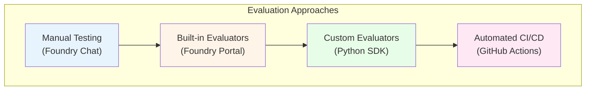
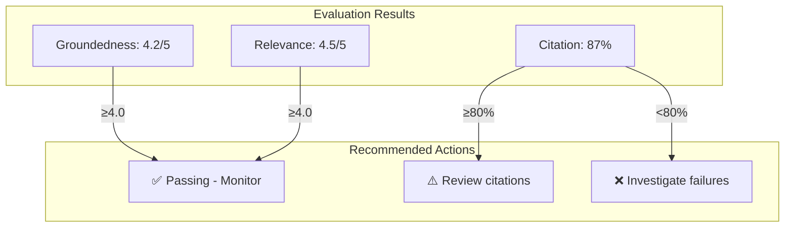
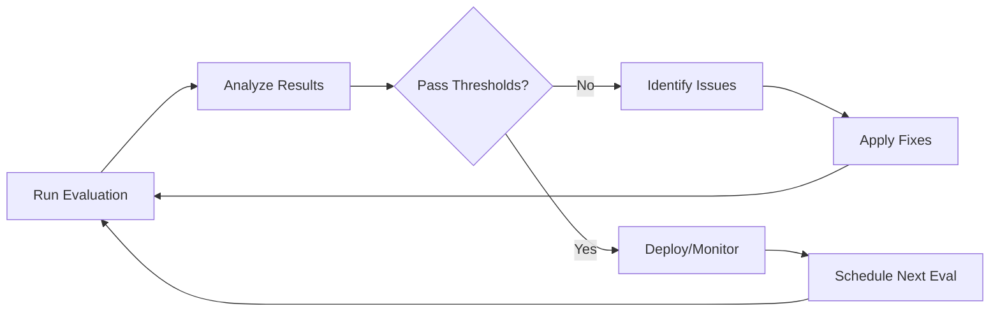

# Evaluating Policy Bot Effectiveness

> How to measure and improve Policy Bot's accuracy using Microsoft Foundry Evaluations

This guide covers how to systematically evaluate your Policy Bot agent to ensure it provides accurate, grounded, and well-cited responses.

---

## Why Evaluate?



| Goal | Metric | Why It Matters |
|------|--------|----------------|
| **Accuracy** | Groundedness | Ensures answers come from indexed documents |
| **Completeness** | Relevance | Verifies agent finds the right information |
| **Usability** | Citation Quality | Confirms citations are accurate and useful |
| **Safety** | Content Safety | Prevents harmful or inappropriate responses |

---

## Evaluation Methods in Microsoft Foundry

Microsoft Foundry provides multiple ways to evaluate your agent:



---

## Method 1: Manual Testing in Foundry Portal

### Quick Validation

1. Navigate to [AI Foundry Portal](https://ai.azure.com)
2. Open your project → **Agents** → **policy-bot**
3. Use the **Chat** interface to test queries

### Test Checklist

| Test Case | Query | Expected Behavior |
|-----------|-------|-------------------|
| Basic definition | "What is a vehicle under Ohio law?" | Grounded answer with Section 4511.01 citation |
| Deep content | "What are the exceptions in 4511.01(A)(1)?" | Answer from deeply nested content |
| Grounding check | "What is the capital of France?" | Graceful decline (out of scope) |
| Citation format | "Define motor vehicle" | Exact blockquote + URL + section number |
| Multi-source | "What are traffic signal requirements?" | Multiple citations if applicable |

---

## Method 2: Built-in Foundry Evaluators

Microsoft Foundry includes pre-built evaluators for RAG applications:

### Available Evaluators

| Evaluator | What It Measures | Use For |
|-----------|------------------|---------|
| **Groundedness** | Are answers derived from retrieved documents? | Hallucination detection |
| **Relevance** | Does the response address the question? | Answer quality |
| **Coherence** | Is the response well-structured and logical? | Readability |
| **Fluency** | Is the language natural and grammatical? | User experience |
| **Retrieval Score** | Are the right documents being retrieved? | Search configuration |
| **Citation Accuracy** | Do citations match the content? | Citation quality |

### Running Built-in Evaluations

1. Navigate to **AI Foundry Portal** → Your Project → **Evaluations**

2. Click **+ New Evaluation**

3. Configure:
   
   | Setting | Value |
   |---------|-------|
   | Evaluation Name | `policy-bot-eval-{date}` |
   | Agent | `policy-bot` |
   | Dataset | Upload or create test dataset |
   | Evaluators | Select: Groundedness, Relevance, Coherence |

4. Click **Run Evaluation**

5. Review results in the **Metrics** dashboard

### Creating a Test Dataset

Create a JSON file with test queries and expected behaviors:

{: .important }
Your Method 2 dataset should include a dedicated **out-of-domain subset** with questions that are
totally unrelated to Ohio ORC Title 45. This validates that the system explicitly confirms it cannot
answer and does not fabricate unsupported information.

Recommended dataset composition:

- 60% in-domain Title 45 legal/procedural questions
- 20% edge/ambiguous questions requiring clarification
- 20% out-of-domain questions that must be declined

For out-of-domain test cases, include explicit expected behavior fields:

- `expected_behavior: "decline_no_knowledge"`
- `expected_refusal_contains`: phrase such as `"I can only answer questions about Ohio Revised Code Title 45"`
- `expected_citations_count: 0`

```json
{
  "test_cases": [
    {
      "id": "def-001",
      "query": "What is the legal definition of a vehicle in Ohio?",
      "expected_source": "Section 4511.01",
      "category": "definitions",
      "difficulty": "easy"
    },
    {
      "id": "def-002",
      "query": "How does Ohio law define reckless operation?",
      "expected_source": "Section 4511.20",
      "category": "definitions",
      "difficulty": "medium"
    },
    {
      "id": "ground-001",
      "query": "What is the GDP of Ohio?",
      "expected_behavior": "decline_no_knowledge",
      "expected_refusal_contains": "I can only answer questions about Ohio Revised Code Title 45",
      "expected_citations_count": 0,
      "category": "grounding_test",
      "difficulty": "easy"
    },
    {
      "id": "ood-001",
      "query": "Who won the 2024 World Series?",
      "expected_behavior": "decline_no_knowledge",
      "expected_refusal_contains": "I can only answer questions about Ohio Revised Code Title 45",
      "expected_citations_count": 0,
      "category": "out_of_domain",
      "difficulty": "easy"
    },
    {
      "id": "ood-002",
      "query": "How do I bake sourdough bread at home?",
      "expected_behavior": "decline_no_knowledge",
      "expected_refusal_contains": "I can only answer questions about Ohio Revised Code Title 45",
      "expected_citations_count": 0,
      "category": "out_of_domain",
      "difficulty": "easy"
    },
    {
      "id": "ood-003",
      "query": "What is the Pythagorean theorem?",
      "expected_behavior": "decline_no_knowledge",
      "expected_refusal_contains": "I can only answer questions about Ohio Revised Code Title 45",
      "expected_citations_count": 0,
      "category": "out_of_domain",
      "difficulty": "easy"
    },
    {
      "id": "deep-001",
      "query": "What exceptions exist under 4511.01(A)(1)(a)?",
      "expected_source": "Section 4511.01(A)(1)(a)",
      "category": "deep_content",
      "difficulty": "hard"
    }
  ]
}
```

---

## Method 3: Custom Evaluators (Python SDK)

For advanced evaluation scenarios, use the Azure AI Evaluation SDK:

### Installation

```bash
pip install azure-ai-evaluation azure-identity
```

### Policy Bot Evaluation Script

```python
"""
Policy Bot Evaluation Script
Evaluates groundedness, citation accuracy, and relevance
"""

import json
from azure.ai.evaluation import (
    GroundednessEvaluator,
    RelevanceEvaluator,
    CoherenceEvaluator,
    evaluate
)
from azure.identity import DefaultAzureCredential

# Configuration
PROJECT_ENDPOINT = "https://your-project.api.azureml.ms"
MODEL_DEPLOYMENT = "gpt-4o"

# Initialize evaluators
credential = DefaultAzureCredential()

groundedness_evaluator = GroundednessEvaluator(
    model_config={
        "azure_endpoint": PROJECT_ENDPOINT,
        "azure_deployment": MODEL_DEPLOYMENT,
    }
)

relevance_evaluator = RelevanceEvaluator(
    model_config={
        "azure_endpoint": PROJECT_ENDPOINT,
        "azure_deployment": MODEL_DEPLOYMENT,
    }
)


def evaluate_policy_bot(test_dataset_path: str):
    """Run evaluation on Policy Bot responses"""
    
    # Load test dataset
    with open(test_dataset_path, 'r') as f:
        test_data = json.load(f)
    
    results = []
    
    for test_case in test_data['test_cases']:
        # Get agent response (replace with actual agent invocation)
        response = invoke_policy_bot(test_case['query'])
        
        # Evaluate groundedness
        groundedness_result = groundedness_evaluator(
            query=test_case['query'],
            response=response['answer'],
            context=response['retrieved_documents']
        )
        
        # Evaluate relevance
        relevance_result = relevance_evaluator(
            query=test_case['query'],
            response=response['answer']
        )
        
        # Custom citation check
        citation_score = evaluate_citations(
            response['answer'],
            response['citations']
        )
        
        results.append({
            'test_id': test_case['id'],
            'query': test_case['query'],
            'groundedness': groundedness_result['groundedness'],
            'relevance': relevance_result['relevance'],
            'citation_accuracy': citation_score,
            'passed': all([
                groundedness_result['groundedness'] >= 4,
                relevance_result['relevance'] >= 4,
                citation_score >= 0.8
            ])
        })
    
    return results


def evaluate_citations(answer: str, citations: list) -> float:
    """
    Custom evaluator for citation quality
    Returns score 0-1
    """
    if not citations:
        return 0.0
    
    score = 0.0
    checks = {
        'has_url': any(c.get('url') for c in citations),
        'has_quote': '>' in answer,  # Blockquote present
        'has_section': any(c.get('section') for c in citations),
    }
    
    score = sum(checks.values()) / len(checks)
    return score


def invoke_policy_bot(query: str) -> dict:
    """Invoke the Policy Bot agent and get response"""
    # Implementation depends on your agent deployment
    # Use Foundry SDK or REST API
    pass


if __name__ == "__main__":
    results = evaluate_policy_bot("test_dataset.json")
    
    # Summary
    passed = sum(1 for r in results if r['passed'])
    total = len(results)
    
    print(f"\nEvaluation Results: {passed}/{total} passed")
    print(f"Groundedness Avg: {sum(r['groundedness'] for r in results)/total:.2f}")
    print(f"Relevance Avg: {sum(r['relevance'] for r in results)/total:.2f}")
    print(f"Citation Accuracy: {sum(r['citation_accuracy'] for r in results)/total:.2%}")
```

### Custom Evaluator for Policy-Specific Checks

```python
"""
Custom Policy Bot Evaluators
"""

from azure.ai.evaluation import EvaluatorBase


class PolicyGroundingEvaluator(EvaluatorBase):
    """
    Evaluates if the response is grounded in Ohio Revised Code
    and doesn't use external knowledge
    """
    
    def __init__(self, **kwargs):
        super().__init__(**kwargs)
        
        # Phrases indicating possible hallucination
        self.warning_phrases = [
            "generally speaking",
            "typically",
            "in most states",
            "usually",
            "i believe",
            "i think"
        ]
        
        # Required citation patterns
        self.citation_patterns = [
            r"section \d+\.\d+",
            r"ohio revised code",
            r"codes\.ohio\.gov"
        ]
    
    def __call__(self, *, query: str, response: str, context: str) -> dict:
        """Evaluate a single response"""
        
        response_lower = response.lower()
        
        # Check for warning phrases
        warning_count = sum(
            1 for phrase in self.warning_phrases 
            if phrase in response_lower
        )
        
        # Check for proper citations
        import re
        citation_count = sum(
            1 for pattern in self.citation_patterns
            if re.search(pattern, response_lower)
        )
        
        # Check if content appears in context
        # (simplified - real implementation would be more sophisticated)
        grounded = any(
            sentence.strip() in context 
            for sentence in response.split('.')
            if len(sentence.strip()) > 20
        )
        
        score = 5  # Start with perfect score
        score -= warning_count  # Deduct for warning phrases
        if citation_count == 0:
            score -= 2  # Deduct for missing citations
        if not grounded:
            score -= 1
        
        return {
            "policy_grounding_score": max(1, score),
            "warning_phrases_found": warning_count,
            "citations_found": citation_count,
            "reasoning": self._generate_reasoning(warning_count, citation_count, grounded)
        }
    
    def _generate_reasoning(self, warnings, citations, grounded):
        reasoning = []
        if warnings > 0:
            reasoning.append(f"Found {warnings} hedging phrases that may indicate uncertainty")
        if citations == 0:
            reasoning.append("No proper legal citations found")
        if not grounded:
            reasoning.append("Some content may not be from retrieved documents")
        if not reasoning:
            reasoning.append("Response appears well-grounded with proper citations")
        return "; ".join(reasoning)


class CitationQualityEvaluator(EvaluatorBase):
    """
    Evaluates the quality and accuracy of citations
    """
    
    def __call__(self, *, response: str, citations: list) -> dict:
        checks = {
            'has_blockquote': '>' in response or '&gt;' in response,
            'has_url': any('http' in str(c) for c in citations),
            'has_section_number': any('section' in str(c).lower() for c in citations),
            'url_is_valid_domain': any('codes.ohio.gov' in str(c) for c in citations)
        }
        
        score = sum(checks.values()) / len(checks) * 5
        
        return {
            "citation_quality_score": round(score, 1),
            "checks": checks,
            "recommendation": self._get_recommendation(checks)
        }
    
    def _get_recommendation(self, checks):
        issues = [k for k, v in checks.items() if not v]
        if not issues:
            return "Citation quality is excellent"
        return f"Improve: {', '.join(issues)}"
```

---

## Method 4: Automated CI/CD Evaluation

Integrate evaluations into your deployment pipeline:

### GitHub Actions Workflow

```yaml
# .github/workflows/evaluate.yml
name: Policy Bot Evaluation

on:
  push:
    branches: [main]
  pull_request:
    branches: [main]
  schedule:
    - cron: '0 6 * * 1'  # Weekly Monday 6 AM

jobs:
  evaluate:
    runs-on: ubuntu-latest
    
    steps:
      - uses: actions/checkout@v4
      
      - name: Set up Python
        uses: actions/setup-python@v4
        with:
          python-version: '3.11'
      
      - name: Install dependencies
        run: |
          pip install azure-ai-evaluation azure-identity
          pip install -r requirements-eval.txt
      
      - name: Azure Login
        uses: azure/login@v1
        with:
          creds: ${{ secrets.AZURE_CREDENTIALS }}
      
      - name: Run Evaluations
        env:
          AZURE_PROJECT_ENDPOINT: ${{ secrets.AZURE_PROJECT_ENDPOINT }}
        run: |
          python evaluation/run_evaluation.py \
            --dataset evaluation/test_dataset.json \
            --output evaluation/results.json
      
      - name: Check Thresholds
        run: |
          python evaluation/check_thresholds.py \
            --results evaluation/results.json \
            --min-groundedness 4.0 \
            --min-relevance 4.0 \
            --min-citation-accuracy 0.8
      
      - name: Upload Results
        uses: actions/upload-artifact@v3
        with:
          name: evaluation-results
          path: evaluation/results.json
      
      - name: Post Results to PR
        if: github.event_name == 'pull_request'
        uses: actions/github-script@v6
        with:
          script: |
            const fs = require('fs');
            const results = JSON.parse(fs.readFileSync('evaluation/results.json'));
            
            const summary = `## Evaluation Results
            
            | Metric | Score | Threshold | Status |
            |--------|-------|-----------|--------|
            | Groundedness | ${results.groundedness.toFixed(2)} | 4.0 | ${results.groundedness >= 4.0 ? '✅' : '❌'} |
            | Relevance | ${results.relevance.toFixed(2)} | 4.0 | ${results.relevance >= 4.0 ? '✅' : '❌'} |
            | Citation Accuracy | ${(results.citation_accuracy * 100).toFixed(0)}% | 80% | ${results.citation_accuracy >= 0.8 ? '✅' : '❌'} |
            `;
            
            github.rest.issues.createComment({
              issue_number: context.issue.number,
              owner: context.repo.owner,
              repo: context.repo.repo,
              body: summary
            });
```

---

## Evaluation Metrics Reference

### Metric Definitions

| Metric | Scale | Interpretation |
|--------|-------|----------------|
| **Groundedness** | 1-5 | 5 = Fully grounded in sources, 1 = Hallucinated |
| **Relevance** | 1-5 | 5 = Directly answers question, 1 = Off-topic |
| **Coherence** | 1-5 | 5 = Well-organized, 1 = Confusing |
| **Citation Accuracy** | 0-100% | Percentage of citations that are valid |

### Target Thresholds for Policy Bot

| Metric | Minimum | Target | Critical |
|--------|---------|--------|----------|
| Groundedness | 4.0 | 4.5+ | < 3.0 |
| Relevance | 4.0 | 4.5+ | < 3.0 |
| Citation Accuracy | 80% | 95%+ | < 70% |

---

## Interpreting Results

### Evaluation Dashboard



### Common Issues and Fixes

| Symptom | Likely Cause | Fix |
|---------|--------------|-----|
| Low groundedness | Agent using training knowledge | Strengthen system prompt grounding rules |
| Low relevance | Poor search results | Tune search index, adjust semantic config |
| Low citation accuracy | Missing URL metadata | Verify index schema includes URL field |
| Inconsistent results | High temperature | Lower temperature to 0.1 |

### Deep Dive: Fixing Low Relevance with Search Index Tuning

When evaluation scores show **low relevance** (below 4.0/5.0), the root cause is typically that Azure AI Search is returning poor results to the agent. Here's a comprehensive guide to diagnose and fix this issue.

#### Step 1: Diagnose Search Quality

Before tuning, test your search index directly to see what the agent is receiving:

```bash
# Test a query directly against your search index
curl -X POST "https://YOUR-SEARCH-SERVICE.search.windows.net/indexes/YOUR-INDEX/docs/search?api-version=2024-07-01" \
  -H "Content-Type: application/json" \
  -H "api-key: YOUR-QUERY-KEY" \
  -d '{
    "search": "what is the penalty for speeding in Ohio",
    "queryType": "semantic",
    "semanticConfiguration": "policy-semantic-config",
    "top": 5,
    "select": "title,content,url"
  }'
```

**What to look for:**
- Are the top 5 results actually relevant to the query?
- Is the content field populated with readable text?
- Are important policy terms appearing in results?

#### Step 2: Tune the Search Index Schema

**A. Add searchable fields for key policy terms:**

```json
{
  "name": "policy-index",
  "fields": [
    { "name": "id", "type": "Edm.String", "key": true },
    { "name": "title", "type": "Edm.String", "searchable": true, "analyzer": "en.microsoft" },
    { "name": "content", "type": "Edm.String", "searchable": true, "analyzer": "en.microsoft" },
    { "name": "url", "type": "Edm.String", "filterable": true, "retrievable": true },
    { "name": "section_number", "type": "Edm.String", "searchable": true, "filterable": true },
    { "name": "chapter", "type": "Edm.String", "searchable": true, "filterable": true },
    { "name": "effective_date", "type": "Edm.DateTimeOffset", "filterable": true, "sortable": true },
    { "name": "content_vector", "type": "Collection(Edm.Single)", "dimensions": 1536, "vectorSearchProfile": "vector-profile" }
  ]
}
```

**B. Use the English Microsoft analyzer** (`en.microsoft`) instead of standard:
- Handles legal terminology better
- Better stemming for policy-specific terms
- Improved handling of numbered sections (e.g., "4511.21")

#### Step 3: Configure Semantic Search (Critical for Policy Content)

Navigate to **Azure Portal → AI Search → Your Index → Semantic Configurations**

**Create or update your semantic configuration:**

```json
{
  "name": "policy-semantic-config",
  "prioritizedFields": {
    "titleField": {
      "fieldName": "title"
    },
    "prioritizedContentFields": [
      { "fieldName": "content" }
    ],
    "prioritizedKeywordsFields": [
      { "fieldName": "section_number" },
      { "fieldName": "chapter" }
    ]
  }
}
```

**Key settings explained:**
| Field | Purpose | Recommendation |
|-------|---------|----------------|
| `titleField` | Used for snippet extraction | Map to page/section title |
| `prioritizedContentFields` | Main text for semantic ranking | Map to full policy text |
| `prioritizedKeywordsFields` | Boost exact matches | Map to section numbers, chapter names |

#### Step 4: Enable Hybrid Search (Vector + Keyword)

Hybrid search combines vector similarity with keyword matching—essential for legal/policy content where exact terminology matters:

**Update your Foundry agent's search configuration:**

```json
{
  "data_sources": [{
    "type": "azure_search",
    "parameters": {
      "endpoint": "https://YOUR-SEARCH.search.windows.net",
      "index_name": "policy-index",
      "query_type": "vector_semantic_hybrid",
      "semantic_configuration": "policy-semantic-config",
      "embedding_dependency": {
        "type": "deployment_name",
        "deployment_name": "text-embedding-ada-002"
      },
      "fields_mapping": {
        "content_fields": ["content"],
        "title_field": "title",
        "url_field": "url",
        "vector_fields": ["content_vector"]
      },
      "top_n_documents": 10,
      "strictness": 3
    }
  }]
}
```

**Query type options:**
| Query Type | Use When |
|------------|----------|
| `simple` | Basic keyword matching only |
| `semantic` | Semantic re-ranking without vectors |
| `vector` | Pure vector similarity search |
| `vector_semantic_hybrid` | **Recommended** - Best of all approaches |

#### Step 5: Adjust Retrieval Parameters

**A. Increase `top_n_documents` for complex queries:**

```json
"top_n_documents": 15  // Default is 5, increase for comprehensive policies
```

**B. Tune `strictness` based on your needs:**

| Strictness | Behavior | Use Case |
|------------|----------|----------|
| 1 | Very loose - returns marginally related content | Exploratory queries |
| 3 | Balanced - good relevance with coverage | **Recommended default** |
| 5 | Very strict - only highly relevant results | Specific legal questions |

**C. Add filters for focused retrieval:**

```json
"filter": "chapter eq 'Traffic Laws' and effective_date ge 2024-01-01"
```

#### Step 6: Re-Index with Chunking Optimization

Poor relevance often comes from documents chunked incorrectly. Adjust your indexer's chunking:

```json
{
  "name": "policy-indexer",
  "skillsetName": "chunking-skillset",
  "parameters": {
    "configuration": {
      "dataToExtract": "contentAndMetadata",
      "parsingMode": "default"
    }
  }
}
```

**Chunking skillset for policy documents:**

```json
{
  "name": "chunking-skillset",
  "skills": [
    {
      "@odata.type": "#Microsoft.Skills.Text.SplitSkill",
      "name": "split-by-section",
      "textSplitMode": "pages",
      "maximumPageLength": 2000,
      "pageOverlapLength": 200,
      "context": "/document"
    }
  ]
}
```

**Chunking recommendations for legal/policy content:**
| Parameter | Value | Reason |
|-----------|-------|--------|
| `maximumPageLength` | 2000 characters | Keeps full sections together |
| `pageOverlapLength` | 200 characters | Ensures context continuity |
| `textSplitMode` | "pages" | Respects document structure |

#### Step 7: Verify Improvements

After making changes, re-run your evaluation:

```python
# Before/after comparison
print("Before tuning:")
print(f"  Relevance: {before_results['relevance']}")

# Apply changes, re-index, wait for completion

print("After tuning:")
print(f"  Relevance: {after_results['relevance']}")
print(f"  Improvement: {after_results['relevance'] - before_results['relevance']:.2f}")
```

#### Common Tuning Scenarios

| Symptom | Diagnosis | Fix |
|---------|-----------|-----|
| Returns wrong policy sections | Chunks too large | Reduce `maximumPageLength` to 1500 |
| Misses relevant content | Chunks too small | Increase to 2500 with 300 overlap |
| Generic, unfocused results | No semantic config | Add semantic configuration |
| Misses exact legal terms | Vector-only search | Enable hybrid search |
| Old content returned | Stale index | Schedule regular re-indexing |
| Missing section numbers | Not in keywords | Add to `prioritizedKeywordsFields` |

#### Quick Reference: Portal Steps

1. **Azure Portal** → **AI Search** → **Your search service**
2. **Indexes** → Select your index → **Edit JSON** to update schema
3. **Semantic configurations** → Create/edit configuration
4. **Indexers** → Your indexer → **Reset** → **Run** to re-index
5. **Search explorer** → Test queries to verify improvements

After tuning, expect relevance scores to improve from sub-3.0 to 4.0+ within 1-2 iteration cycles.

---

## Continuous Improvement Workflow



### Weekly Evaluation Checklist

- [ ] Run automated evaluation suite
- [ ] Review any failed test cases
- [ ] Check for new content in source website
- [ ] Re-index if content updated
- [ ] Update test dataset if new scenarios identified
- [ ] Review user feedback for new test cases

---

## Related Documentation

- [Architecture](architecture.md) - How the agent works
- [Pain Points Addressed](pain-points-addressed.md) - Grounding strategy details
- [Foundry Agent Configuration](../foundry/README.md) - Agent settings
- [Microsoft Evaluation Documentation](https://learn.microsoft.com/azure/ai-studio/how-to/evaluate-generative-ai-app)
