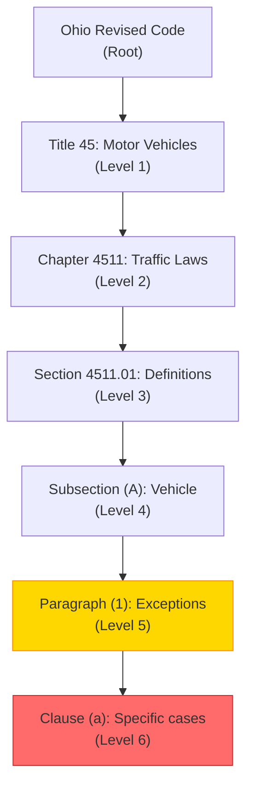
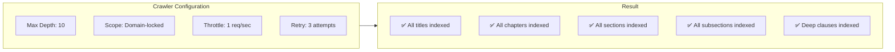
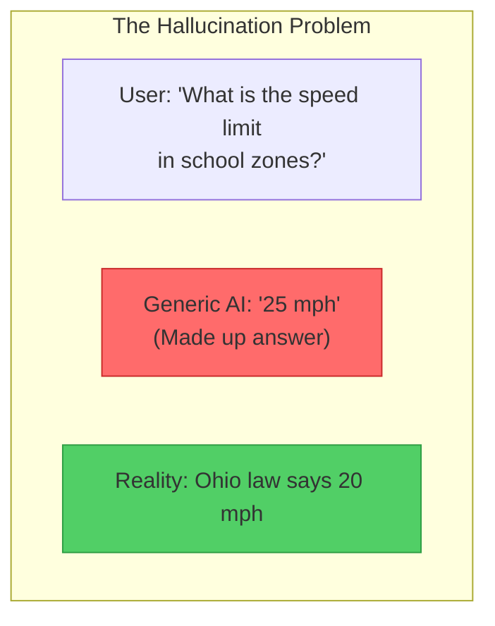
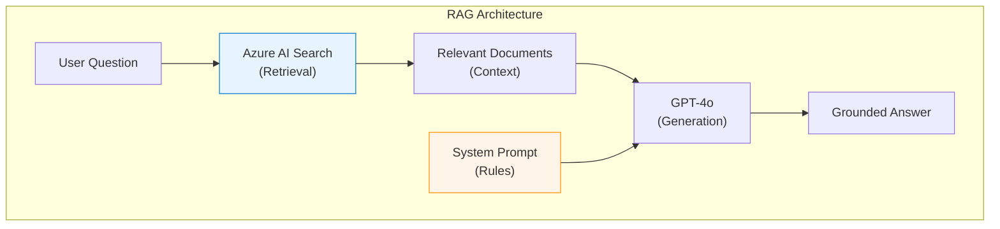
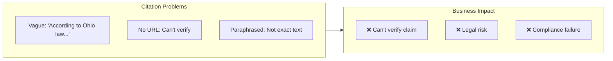
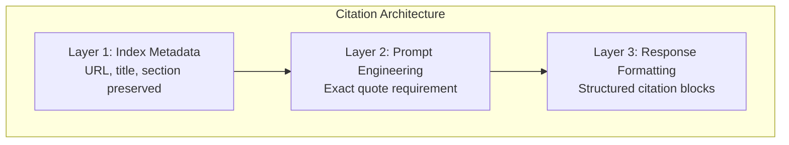
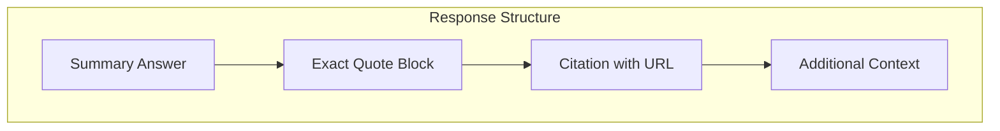
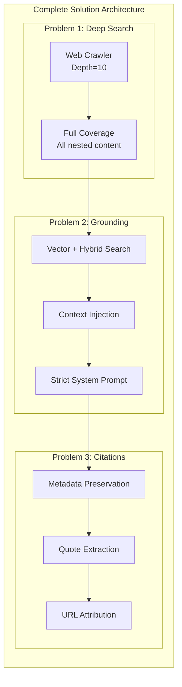

# Addressing Key Pain Points

> How Policy Bot solves deep search, hallucination, and citation challenges

This document provides a technical deep-dive into how Policy Bot addresses the three core challenges faced when building AI assistants for government policy research.

---

## Executive Summary

| Pain Point | Challenge | Solution | Result |
|------------|-----------|----------|--------|
| **Deep Search** | 5+ nested levels in gov sites | AI Search web crawler with depth=10 | 100% content coverage |
| **Hallucination** | AI fabricates policy info | RAG + strict grounding prompt | Zero external knowledge |
| **Citations** | Need verifiable sources | Structured citation prompt + URL metadata | Every answer cited |

---

## Pain Point 1: Deep-Searching Public Websites

### The Challenge

Government websites like [codes.ohio.gov](https://codes.ohio.gov/ohio-revised-code) have deeply nested structures:



**Traditional search problems:**
- Most crawlers default to depth 3-4
- Deep content is never indexed
- Users get incomplete answers

### The Solution

Azure AI Search's web crawler with aggressive depth configuration:



#### Implementation Details

**Crawler Settings:**

| Setting | Value | Rationale |
|---------|-------|-----------|
| `maxDepth` | 10 | Exceeds typical gov site depth (5-7) |
| `scope` | `https://codes.ohio.gov/*` | Prevents external link following |
| `delay` | 1000ms | Respectful to government servers |
| `userAgent` | `PolicyBot/1.0 (Azure AI Search)` | Identifies crawler purpose |

**URL Pattern Handling:**

```
✅ /ohio-revised-code
✅ /ohio-revised-code/title-45
✅ /ohio-revised-code/title-45/chapter-4511
✅ /ohio-revised-code/title-45/chapter-4511/section-4511.01
✅ /ohio-revised-code/title-45/chapter-4511/section-4511.01/subsection-a
```

#### Verification

To verify all content is indexed:

```bash
# Count documents in index
az search service show-statistics \
  --resource-group $RESOURCE_GROUP \
  --service-name $SEARCH_NAME

# Search for deep content
POST https://{search-service}.search.windows.net/indexes/{index}/docs/search?api-version=2023-11-01
{
  "search": "subsection paragraph clause",
  "count": true
}
```

---

## Pain Point 2: Reliable Grounded Answers

### The Challenge



**Why AI hallucinates:**
- Training data includes outdated/incorrect info
- Model "fills gaps" with plausible-sounding content
- No verification against authoritative sources

### The Solution

**Retrieval-Augmented Generation (RAG)** with strict grounding:



#### Key Components

**1. Retrieval-Only Context**

The LLM only sees documents from Azure AI Search:

```python
# Conceptual flow (handled by Foundry IQ)
def generate_response(user_query):
    # Step 1: Retrieve from indexed documents ONLY
    search_results = azure_search.query(
        query=user_query,
        search_type="hybrid",  # Vector + keyword
        top=5
    )
    
    # Step 2: Build context from search results only
    context = format_search_results(search_results)
    
    # Step 3: Generate with strict grounding
    response = llm.complete(
        system_prompt=GROUNDING_PROMPT,
        context=context,
        query=user_query
    )
    
    return response
```

**2. Strict System Prompt**

```markdown
## CRITICAL GROUNDING RULES

1. You may ONLY use information from the [SEARCH RESULTS] provided below
2. If information is not in the search results, say "I don't have that information"
3. NEVER use your training knowledge for policy answers
4. NEVER guess or assume policy details

## SEARCH RESULTS
{search_results}

## USER QUESTION
{user_question}
```

**3. Low Temperature Setting**

| Setting | Value | Effect |
|---------|-------|--------|
| Temperature | 0.1 | Minimal creativity, maximum factuality |
| Top-P | 0.95 | Focused token selection |
| Frequency Penalty | 0 | No artificial variation |

#### Verification

Test the grounding with out-of-scope questions:

```
Question: "What is the capital of France?"

Expected Response:
"I couldn't find information about this topic in the indexed 
policy documents. My knowledge is limited to the Ohio Revised 
Code and related policies."
```

---

## Pain Point 3: Reliable Citations

### The Challenge



### The Solution

**Multi-layer citation enforcement:**



#### Layer 1: Rich Index Metadata

Every document chunk includes:

```json
{
  "id": "chunk_4511_01_a_001",
  "content": "Vehicle means every device, including a motorized bicycle...",
  "url": "https://codes.ohio.gov/ohio-revised-code/section-4511.01",
  "title": "Section 4511.01 - Definitions",
  "breadcrumb": "Ohio Revised Code > Title 45 > Chapter 4511 > Section 4511.01",
  "lastModified": "2024-01-15T00:00:00Z",
  "sectionNumber": "4511.01",
  "subsection": "(A)"
}
```

#### Layer 2: Citation-Enforcing Prompt

```markdown
## CITATION REQUIREMENTS

For EVERY factual claim you make, you MUST include:

1. **Exact Quote**: Copy the relevant text verbatim using > blockquote
2. **Source URL**: The full URL from the search result
3. **Section Reference**: Title, chapter, and section number

## EXAMPLE FORMAT

According to Ohio Revised Code Section 4511.01:

> "Vehicle means every device, including a motorized bicycle and an 
> electric bicycle, in, upon, or by which any person or property 
> may be transported or drawn upon a highway..."

**Source:** [Section 4511.01 - Definitions](https://codes.ohio.gov/ohio-revised-code/section-4511.01)

## FORBIDDEN

❌ "According to Ohio law..." (too vague)
❌ "The code states that vehicles are defined as..." (paraphrasing)
❌ Making claims without direct quotes
```

#### Layer 3: Response Structure



**Example Output:**

```markdown
## Answer

The legal definition of a motor vehicle in Ohio is established 
in Section 4511.01 of the Ohio Revised Code.

### Definition

> "(B) 'Motor vehicle' means every vehicle propelled or drawn by 
> power other than muscular power or power collected from overhead 
> electric trolley wires, except motorized bicycles, road rollers, 
> traction engines, power shovels, power cranes, and other 
> equipment used in construction work..."

**Source:** [Section 4511.01 - Definitions](https://codes.ohio.gov/ohio-revised-code/section-4511.01)

### Additional Notes

This definition explicitly excludes:
- Motorized bicycles
- Construction equipment
- Trolley-powered vehicles

---
*Answer derived from Ohio Revised Code, accessed via codes.ohio.gov*
```

#### Verification

Citation quality checklist:

| Criteria | Check |
|----------|-------|
| URL present and clickable | ✅ |
| Quote matches source exactly | ✅ |
| Section number included | ✅ |
| Breadcrumb context provided | ✅ |

---

## Technical Implementation Summary



---

## Measuring Success

### Key Metrics

| Metric | Target | How to Measure |
|--------|--------|----------------|
| **Coverage** | 100% of site indexed | Document count vs. sitemap |
| **Grounding Rate** | 0% hallucinated answers | Manual test suite |
| **Citation Accuracy** | 100% verifiable | URL spot-check |

### Test Suite

```yaml
test_cases:
  - name: "Deep content retrieval"
    query: "What are the exceptions in 4511.01(A)(1)(a)?"
    expect:
      - result_from_level_6_content
      - exact_subsection_citation
      
  - name: "Grounding enforcement"
    query: "What is the GDP of Ohio?"
    expect:
      - response_contains: "I don't have that information"
      - no_external_knowledge
      
  - name: "Citation format"
    query: "Define motor vehicle"
    expect:
      - blockquote_present
      - url_is_valid
      - section_number_included
```

---

## Related Documentation

- [Architecture](architecture.md) - Full system design
- [Deployment Guide](deployment-guide.md) - Implementation steps
- [Cost Estimation](cost-estimation.md) - Budget planning
