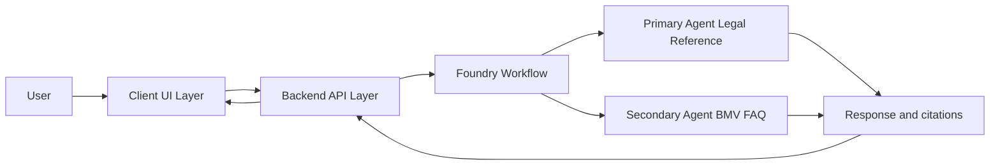
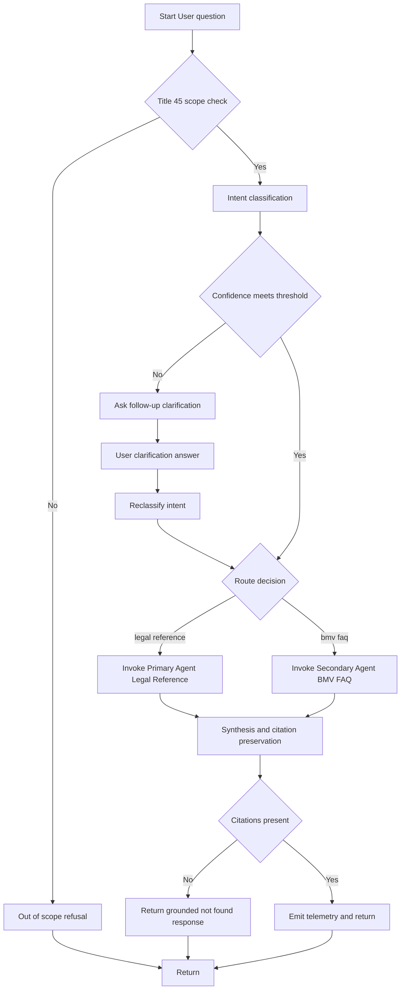
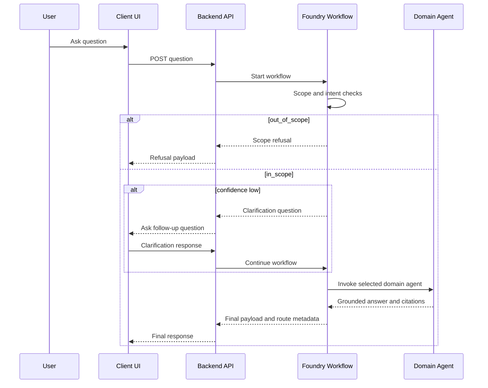
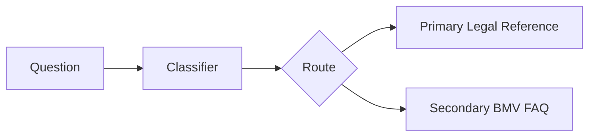
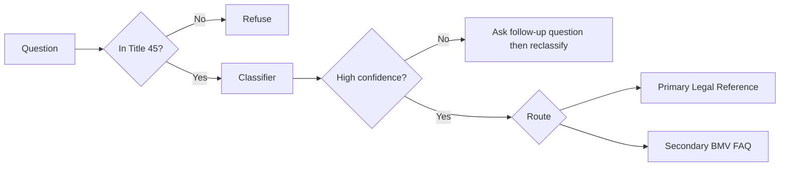
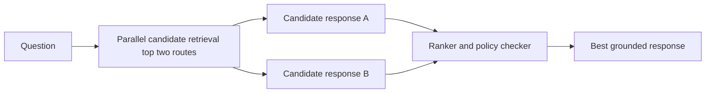

# Workflow Architecture
{: .no_toc }

## Table of contents
{: .no_toc .text-delta }

1. TOC
{:toc}

---

## Why this is the recommended design

This design uses **Microsoft Foundry Workflow** as the orchestration layer and a
**backend API** as the security and integration boundary. The workflow performs
scope checks, intent routing, and clarification handling before invoking a domain agent.

Use this architecture when you need:

- more deterministic routing behavior
- node-level observability and troubleshooting
- easier A/B tests for routing policy
- strict pre- and post-processing gates

---

## Key Principles

- Backend API is the orchestration and security boundary
- Foundry workflow owns routing policy, not prompt-only logic
- Domain agents are specialized by intent
- The system can ask follow-up clarification questions before final routing
- All answers remain grounded with citations

---

## Backend and Workflow Topology

---

## Workflow Reference Design

### Static Decision Tree Image

For environments where Mermaid rendering is unavailable, this static diagram provides the
same routing logic view:

---

## End-to-End Query Sequence

### Static Sequence Image

For environments where Mermaid rendering is unavailable, this static sequence diagram
shows the same execution path:

---

## Workflow Possibilities (Design Variants)

### 1) Single classifier router (simplest)

Best when you need predictable behavior with minimal operational overhead.

### 2) Two-stage router with clarification loop

Best when reducing misroutes is more important than raw latency.

### 3) Parallel candidate plus ranker

Best for ambiguous questions, but highest cost and latency.

---

## Mapping to Domain Agents

| Workflow route label | Domain agent |
|----------------------|-------------|
| `legal_reference` | Primary Agent Legal Reference |
| `bmv_faq` | Secondary Agent BMV FAQ |

---

## Non-Goals

- No authentication workflows for end users in this release
- No transactional operations
- No database writes from agent responses
- No legal advice output
- No use of PDF files as grounding source
- No unrestricted general internet knowledge
- No autonomous agentic actions

---

## Operational Benefits and Trade-offs

| Dimension | Prompt-only Orchestrator | Workflow-Orchestrated Design |
|-----------|----------------------------|-----------------------------------|
| Routing transparency | Prompt-dependent | Explicit decision nodes |
| Determinism | Medium | High |
| Observability | Aggregate response-level | Per-node metrics and traces |
| Change management | Prompt edits | Node policy updates |
| Latency | Lower | Slightly higher (extra nodes) |
| Cost | Lower | Slightly higher |

---

## Follow-Up Question Policy

- Ask follow-up questions only when classification confidence is below threshold
- Limit to one or two clarification turns per user query
- If ambiguity remains, route to Primary Agent Legal Reference with explicit uncertainty text
- Preserve user context and citations across clarification turns

---

## Related Documentation

- [Architecture]({{ site.baseurl }}/architecture)
- [Configuration Reference]({{ site.baseurl }}/configuration)
- [Deployment Guide]({{ site.baseurl }}/deployment-guide)
- [Evaluation Guide]({{ site.baseurl }}/evaluation-guide)
