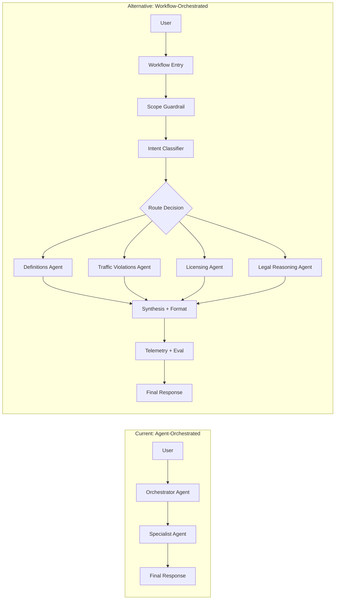
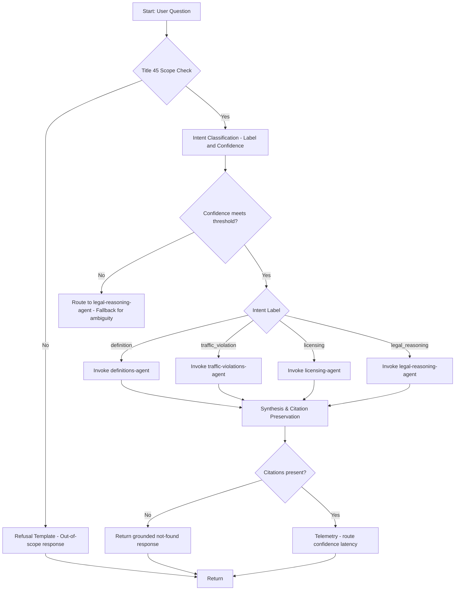
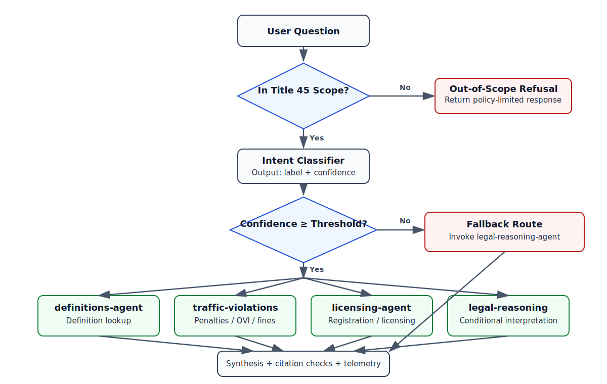
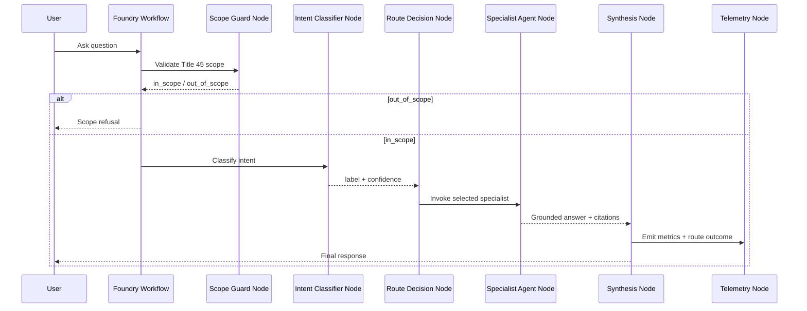
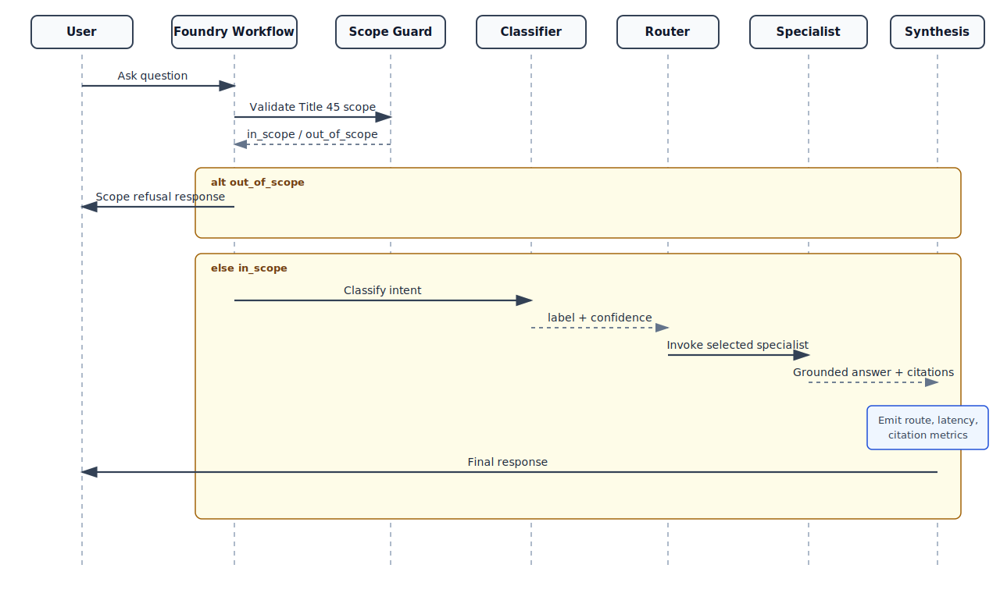
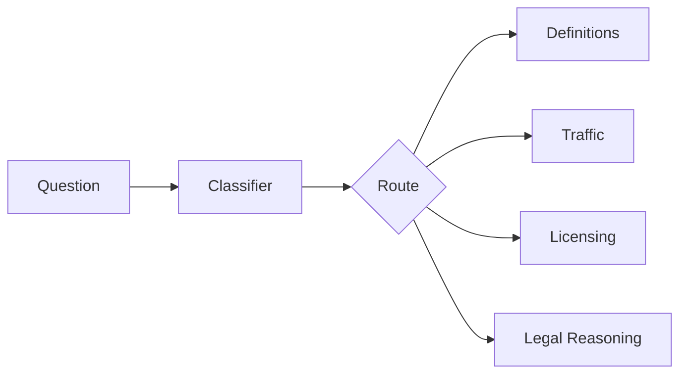
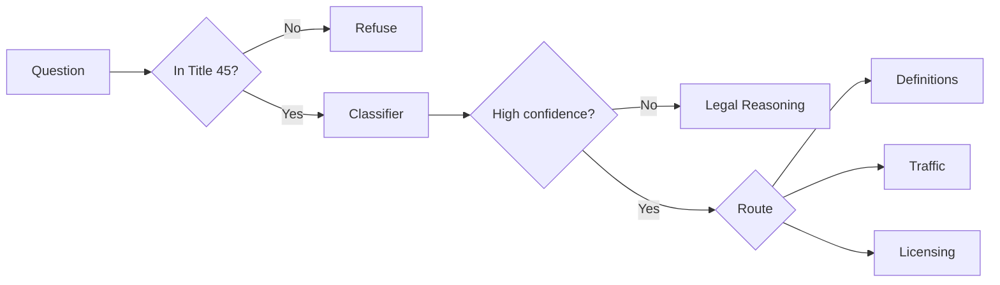
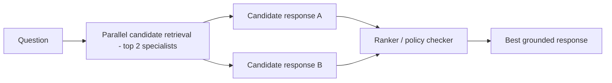

# Workflow Architecture (Alternative)
{: .no_toc }

## Table of contents
{: .no_toc .text-delta }

1. TOC
{:toc}

---

## Why this alternative exists

The current design uses an **Orchestrator Agent** that classifies intent in its prompt and then
calls one specialist agent. This page documents an alternative where **Microsoft Foundry Workflow**
coordinates routing and control flow explicitly.

Use this alternative when you want:

- more deterministic routing behavior
- node-level observability and troubleshooting
- easier A/B tests for routing policy
- strict pre- and post-processing gates

---

## Current vs Workflow-Orchestrated

---

## Workflow Reference Design

### Static Decision Tree Image

For environments where Mermaid rendering is unavailable, this static diagram provides the
same routing logic view:

---

## End-to-End Query Sequence

### Static Sequence Image

For environments where Mermaid rendering is unavailable, this static sequence diagram
shows the same execution path:

---

## Workflow Possibilities (Design Variants)

### 1) Single-Classifer Router (simplest)

Best when you need predictable behavior with minimal operational overhead.

### 2) Two-Stage Router (higher precision)

Best when reducing misroutes is more important than raw latency.

### 3) Parallel Candidate + Ranker (maximum robustness)

Best for ambiguous questions, but highest cost and latency.

---

## Mapping to Existing Agents

This workflow design reuses the existing specialist agents and keeps their role boundaries:

| Workflow route label | Existing connected agent |
|----------------------|--------------------------|
| `definition` | `definitions-agent` |
| `traffic_violation` | `traffic-violations-agent` |
| `licensing` | `licensing-agent` |
| `legal_reasoning` | `legal-reasoning-agent` |

---

## Operational Benefits and Trade-offs

| Dimension | Current Orchestrator Agent | Workflow-Orchestrated Alternative |
|-----------|----------------------------|-----------------------------------|
| Routing transparency | Prompt-dependent | Explicit decision nodes |
| Determinism | Medium | High |
| Observability | Aggregate response-level | Per-node metrics and traces |
| Change management | Prompt edits | Node policy updates |
| Latency | Lower | Slightly higher (extra nodes) |
| Cost | Lower | Slightly higher |

---

## Suggested Adoption Path

1. Keep current architecture as production baseline.
2. Implement a workflow in parallel for shadow traffic.
3. Compare route accuracy, citation completeness, latency, and refusal correctness.
4. Promote workflow to primary path when metrics are equal or better.

---

## Related Documentation

- [Architecture]({{ site.baseurl }}/architecture)
- [Configuration Reference]({{ site.baseurl }}/configuration)
- [Evaluation Guide]({{ site.baseurl }}/evaluation-guide)
