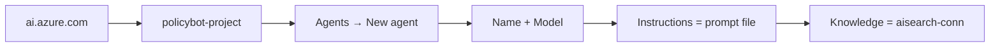

# Foundry Agent Configuration

> Multi-agent configuration for the Policy Bot on Microsoft Foundry (Azure AI Foundry)

This directory contains all agent configurations and system prompts for the **Ohio ORC Title 45**
multi-agent Policy Bot. Five specialized agents share a single AI Search knowledge source and are
coordinated by an Orchestrator.

---

## Directory Structure

```
foundry/
├── README.md                              # This file
├── agent-config.json                      # Multi-agent configuration (reference)
└── prompts/
    ├── system-prompt.md                   # Legacy single-agent prompt (archived)
    ├── orchestrator-prompt.md             # Orchestrator — routes all user questions
    ├── definitions-agent-prompt.md        # Definitions Specialist (ORC Chapter 4501)
    ├── traffic-violations-agent-prompt.md # Traffic & Violations Specialist (Chapter 4511)
    ├── licensing-agent-prompt.md          # Licensing & Registration Specialist (4503/4507)
    └── legal-reasoning-agent-prompt.md    # Legal Reasoning Specialist (o3-mini)
```

---

## Agent Overview

| Agent | Role | Model | Temp | ORC Focus |
|-------|------|-------|------|-----------|
| **Orchestrator** | Entry point — classifies & routes | `gpt-4o` | 0.1 | All of Title 45 |
| **Definitions Specialist** | Verbatim statutory definitions | `gpt-4o` | 0 | Chapter 4501 |
| **Traffic & Violations Specialist** | Penalties, OVI, traffic law | `gpt-4o` | 0 | Chapter 4511 |
| **Licensing & Registration Specialist** | Procedures, fees, forms | `gpt-4o-mini` | 0.1 | Chapters 4503, 4507 |
| **Legal Reasoning Specialist** | Complex multi-section analysis | `o3-mini` | 1 | Cross-chapter |

### Why Different Models?

- **`gpt-4o`** (Orchestrator, Definitions, Traffic): High-precision reasoning, exact legal text.
- **`gpt-4o-mini`** (Licensing): Procedural/administrative questions are lower complexity; using
  a smaller model reduces per-query cost at higher volume.
- **`o3-mini`** (Legal Reasoning): OpenAI's reasoning model — designed for multi-step chain-of-thought
  analysis of conditional or cross-section legal questions. Temperature must be `1` for reasoning models.

---

## agent-config.json

This is a **reference configuration** that documents the recommended settings for all agents.
Agents are configured through the Foundry portal UI; this file serves as:

1. Version-controlled documentation of exact settings
2. A template for programmatic agent creation (future)
3. Reference for auditing agent configuration drift

**Key shared settings (all agents):**

| Setting | Value | Purpose |
|---------|-------|---------|
| Knowledge source | `ohio-title45-index` | Grounds all answers |
| Query type | `vector_semantic_hybrid` | Best recall for legal language |
| Top K | `10` | Retrieve 10 most relevant chunks |
| Strictness | `4` | High confidence required |
| In scope only | ✅ | Cannot use training knowledge |

---

## Configuration Steps in Foundry Portal

> **Important:** Create the four **specialist agents first**, then create the **Orchestrator last**.
> The Orchestrator must connect to the specialists as "tools" (connected agents) — they must
> exist before configuring the Orchestrator.

### Order of Creation

1. `definitions-agent`
2. `traffic-violations-agent`
3. `licensing-agent`
4. `legal-reasoning-agent`
5. `orchestrator` (last)

### For Each Specialist Agent



| Field | Value |
|-------|-------|
| Agent Name | (see table above) |
| Model | (see table above) |
| Temperature | (see table above) |
| Instructions | contents of the agent's `prompts/*.md` file |
| Knowledge → Connection | `aisearch-conn` |
| Knowledge → Index | `ohio-title45-index` |
| Search type | Hybrid (vector + keyword) |
| Semantic ranker | Enabled — `policy-semantic-config` |
| Top K | `10` |
| Strictness | `4` |
| In scope only | ✅ Enabled |

### For the Orchestrator Agent (last)

After creating the 4 specialists, create the Orchestrator and add each specialist as a
**Connected Agent** (tool):

1. In the Orchestrator's configuration, click **"Add a tool"** → **"Agent"**
2. Select `definitions-agent` → tool name: `definitions-agent`
3. Repeat for `traffic-violations-agent`, `licensing-agent`, `legal-reasoning-agent`
4. Paste `orchestrator-prompt.md` in the Instructions field

---

## Test Queries by Agent

### Orchestrator (entry point for all users)
| Query | Expected Routing |
|-------|----------------|
| "What is the legal definition of a vehicle?" | → Definitions Agent |
| "What are the penalties for OVI?" | → Traffic & Violations Agent |
| "How do I renew my license plates?" | → Licensing Agent |
| "If I was convicted of OVI 8 years ago, does my new OVI count as a second offense?" | → Legal Reasoning Agent |
| "What is the capital of France?" | Scope refusal — not routed |

### Definitions Agent (gpt-4o, temp=0)
| Query | Expected Behavior |
|-------|----------------|
| "Define 'motor vehicle'" | Verbatim ORC § 4501.01 text + URL |
| "What does 'operator' mean under ORC?" | ORC § 4501.01 definition |

### Traffic & Violations Agent (gpt-4o, temp=0)
| Query | Expected Behavior |
|-------|----------------|
| "Penalties for OVI first offense?" | Penalty tier, jail range, fine, citation |
| "Is running a red light a misdemeanor?" | Offense degree + ORC cite |

### Licensing Agent (gpt-4o-mini, temp=0.1)
| Query | Expected Behavior |
|-------|----------------|
| "How do I register a vehicle in Ohio?" | Numbered steps with ORC §§ 4503.x cites |
| "What documents do I need for a driver license?" | Bulleted list with ORC §§ 4507.x cites |

### Legal Reasoning Agent (o3-mini, temp=1)
| Query | Expected Behavior |
|-------|----------------|
| "If my license expired, am I still covered by ORC 4507 while renewing?" | Chain-of-thought + conclusion + disclaimer |

---

## Troubleshooting

### Issue: Agent not using search results

- [ ] Knowledge source is connected
- [ ] Index has documents (run indexer)
- [ ] "In scope only" is enabled
- [ ] System prompt includes grounding rules

### Issue: Citations missing

- [ ] System prompt has citation format instructions
- [ ] Search results include URL field
- [ ] Semantic configuration is enabled

### Issue: Orchestrator not routing correctly

- [ ] All 4 specialists are connected as tools
- [ ] Tool names match: `definitions-agent`, `traffic-violations-agent`, `licensing-agent`, `legal-reasoning-agent`
- [ ] Orchestrator system prompt (`orchestrator-prompt.md`) is fully pasted

### Issue: o3-mini errors / temperature warning

- [ ] o3-mini REQUIRES temperature=1 — do not set 0
- [ ] Max tokens for o3-mini should be at least 4096 (reasoning uses more tokens)

### Issue: Hallucinated content

- [ ] Temperature is low (0 or 0.1) for non-reasoning agents
- [ ] System prompt has strict grounding rules
- [ ] "In scope only" toggle is enabled
- [ ] Search index has relevant content

---

## Change Log

| Date | Change | Author |
|------|--------|--------|
| Initial | Created initial single-agent configuration | Setup |
| v2.0 | Expanded to 5-agent multi-model architecture | Policy Bot Team |


- [Azure AI Search Documentation](https://learn.microsoft.com/azure/search/)
- [RAG Best Practices](https://learn.microsoft.com/azure/ai-services/openai/concepts/retrieval-augmented-generation)
