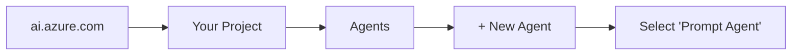

# Foundry Agent Configuration

> Configuration files for the Policy Bot agent in Microsoft Foundry

This directory contains the agent configuration and system prompts used by Policy Bot.

---

## Directory Structure

```
foundry/
├── README.md              # This file
├── agent-config.json      # Agent configuration (reference only)
├── prompts/
│   └── system-prompt.md   # System prompt for the agent
└── search-config.json     # Generated search configuration (after setup)
```

---

## Files Overview

### agent-config.json

This is a **reference configuration** that documents the recommended settings for the Policy Bot agent. While Microsoft Foundry configures agents through its portal interface, this file serves as:

1. Documentation of the exact settings to use
2. A template for programmatic agent creation (future)
3. Version control for agent configuration changes

**Key Settings:**

| Setting | Value | Purpose |
|---------|-------|---------|
| Model | GPT-4o | High accuracy for policy interpretation |
| Temperature | 0.1 | Minimal creativity for factual responses |
| Top-K | 5 | Number of search results to retrieve |
| Query Type | Hybrid | Combined vector + keyword search |
| In Scope | true | Only use indexed content (no web search) |

### prompts/system-prompt.md

The system prompt that defines how Policy Bot behaves. This includes:

- Identity and personality
- Grounding rules (CRITICAL for accuracy)
- Citation format requirements
- Response structure templates
- Error handling instructions

**To use this prompt:**

1. Open Microsoft Foundry Portal
2. Navigate to your agent
3. Copy the entire content of `system-prompt.md`
4. Paste into the "System Prompt" configuration field

---

## Configuration Steps in Foundry Portal

### Step 1: Create New Agent



### Step 2: Configure Model

| Field | Value |
|-------|-------|
| Agent Name | `policy-bot` |
| Model | `GPT-4o` |
| Deployment | Your GPT-4o deployment |
| Temperature | `0.1` |

### Step 3: Add Knowledge Source

1. Click **"+ Add Knowledge"**
2. Select **"Azure AI Search"**
3. Connect to your search service
4. Select your index (`policy-index`)
5. Configure semantic settings:

| Setting | Value |
|---------|-------|
| Query Type | Hybrid |
| Semantic Config | policy-semantic-config |
| Top K | 5 |
| Strictness | 3 (High) |
| In Scope | ✅ Enabled |

### Step 4: Configure System Prompt

1. Navigate to **"Instructions"** tab
2. Copy content from `prompts/system-prompt.md`
3. Paste into the system prompt field
4. Click **"Save"**

### Step 5: Test Configuration

Use these test queries to verify proper setup:

| Query | Expected Behavior |
|-------|-------------------|
| "What is a vehicle under Ohio law?" | Grounded response with Section 4511.01 citation |
| "What is the capital of France?" | Graceful decline (out of scope) |
| "Define motor vehicle" | Exact quote with URL |

---

## Updating the Agent

When making changes to the agent:

1. **Update this repo first** - Modify files in this directory
2. **Copy to Foundry** - Apply changes in the portal
3. **Document in Git** - Commit with descriptive message
4. **Test thoroughly** - Verify grounding still works

### Change Log

| Date | Change | Author |
|------|--------|--------|
| Initial | Created initial configuration | Setup |

---

## Troubleshooting

### Issue: Agent not using search results

**Check:**
- [ ] Knowledge source is connected
- [ ] Index has documents (run indexer)
- [ ] "In Scope" is enabled
- [ ] System prompt includes grounding rules

### Issue: Citations missing

**Check:**
- [ ] System prompt has citation format instructions
- [ ] Search results include URL field
- [ ] Semantic configuration is enabled

### Issue: Hallucinated content

**Check:**
- [ ] Temperature is low (0.1-0.3)
- [ ] System prompt has strict grounding rules
- [ ] "In Scope" is enabled
- [ ] Search index has relevant content

---

## Additional Resources

- [Microsoft Foundry Documentation](https://learn.microsoft.com/azure/ai-foundry/)
- [Azure AI Search Documentation](https://learn.microsoft.com/azure/search/)
- [RAG Best Practices](https://learn.microsoft.com/azure/ai-services/openai/concepts/retrieval-augmented-generation)
