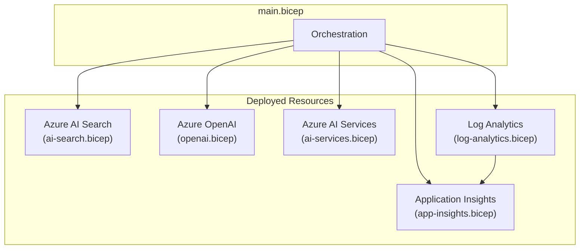

# Infrastructure as Code

> Bicep templates for deploying Policy Bot Azure resources

---

## Overview

This directory contains Azure Bicep templates for deploying all infrastructure required by Policy Bot. The templates follow Azure best practices and are designed for easy customization.

---

## Architecture



---

## Directory Structure

```
infra/
├── README.md           # This file
├── main.bicep          # Main deployment template
└── modules/
    ├── ai-search.bicep     # Azure AI Search
    ├── ai-services.bicep   # Azure AI Services (for Foundry)
    ├── app-insights.bicep  # Application Insights
    ├── log-analytics.bicep # Log Analytics Workspace
    └── openai.bicep        # Azure OpenAI Service
```

---

## Quick Start

### Prerequisites

- Azure CLI installed
- Bicep CLI (included with Azure CLI 2.20.0+)
- Azure subscription with Contributor access

### Deploy

```bash
# Login to Azure
az login

# Create resource group
az group create --name rg-policybot --location eastus2

# Deploy all resources
az deployment group create \
  --resource-group rg-policybot \
  --template-file main.bicep
```

### Deploy with Parameters

```bash
az deployment group create \
  --resource-group rg-policybot \
  --template-file main.bicep \
  --parameters \
      location=eastus2 \
      searchSku=standard \
      searchReplicaCount=3 \
      enableSemanticSearch=true \
      openAiTpm=60000
```

---

## Parameters

### main.bicep Parameters

| Parameter | Type | Default | Description |
|-----------|------|---------|-------------|
| `location` | string | Resource group location | Azure region for resources |
| `uniqueSuffix` | string | Auto-generated | Suffix for unique resource names |
| `searchSku` | string | `basic` | AI Search tier (basic, standard, standard2, standard3) |
| `searchReplicaCount` | int | 1 | Number of search replicas (3+ for 99.9% SLA) |
| `searchPartitionCount` | int | 1 | Number of search partitions |
| `enableSemanticSearch` | bool | true | Enable semantic search capability |
| `openAiDeploymentName` | string | `gpt-4o` | Name for GPT model deployment |
| `openAiModelVersion` | string | `2024-08-06` | GPT model version |
| `openAiTpm` | int | 30000 | Tokens per minute quota |
| `tags` | object | See template | Resource tags |

### Parameter File Example

Create a `parameters.json` file for custom deployments:

```json
{
  "$schema": "https://schema.management.azure.com/schemas/2019-04-01/deploymentParameters.json#",
  "contentVersion": "1.0.0.0",
  "parameters": {
    "location": {
      "value": "eastus2"
    },
    "searchSku": {
      "value": "standard"
    },
    "searchReplicaCount": {
      "value": 3
    },
    "openAiTpm": {
      "value": 60000
    },
    "tags": {
      "value": {
        "project": "policybot",
        "environment": "production",
        "costCenter": "IT-001"
      }
    }
  }
}
```

Deploy with parameter file:

```bash
az deployment group create \
  --resource-group rg-policybot \
  --template-file main.bicep \
  --parameters @parameters.json
```

---

## Modules

### ai-search.bicep

Deploys Azure AI Search for document indexing and retrieval.

**Features:**
- Configurable SKU (basic to standard3)
- Semantic search capability
- Multiple replica support for high availability
- API key authentication (default)

**Outputs:**
- `serviceName` - Search service name
- `endpoint` - Search service endpoint URL

### openai.bicep

Deploys Azure OpenAI Service with model deployments.

**Deployed Models:**
- GPT-4o (configurable version)
- text-embedding-ada-002 (for vector search)

**Outputs:**
- `serviceName` - OpenAI service name
- `endpoint` - OpenAI endpoint URL
- `gpt4oDeploymentName` - GPT-4o deployment name

### ai-services.bicep

Deploys Azure AI Services (multi-service account) required for Microsoft Foundry.

**Features:**
- Multi-service Cognitive Services account
- S0 SKU (standard)
- Public network access enabled

### log-analytics.bicep

Deploys Log Analytics Workspace for centralized logging.

**Features:**
- PerGB2018 pricing tier
- Configurable retention (default 30 days)
- Daily quota to control costs

### app-insights.bicep

Deploys Application Insights connected to Log Analytics.

**Features:**
- Connected to Log Analytics workspace
- 90-day retention
- Full sampling (100%)

---

## Outputs

After deployment, these outputs are available:

| Output | Description |
|--------|-------------|
| `searchServiceName` | AI Search service name |
| `searchEndpoint` | AI Search endpoint URL |
| `openAiServiceName` | Azure OpenAI service name |
| `openAiEndpoint` | Azure OpenAI endpoint URL |
| `aiServicesName` | AI Services resource name |
| `aiServicesEndpoint` | AI Services endpoint URL |
| `appInsightsName` | Application Insights name |
| `appInsightsConnectionString` | App Insights connection string |
| `logAnalyticsWorkspaceId` | Log Analytics workspace ID |

### Get Outputs

```bash
# Get all outputs
az deployment group show \
  --resource-group rg-policybot \
  --name main \
  --query properties.outputs

# Get specific output
az deployment group show \
  --resource-group rg-policybot \
  --name main \
  --query properties.outputs.searchEndpoint.value \
  -o tsv
```

---

## Customization

### Add Private Endpoints

For enhanced security, add private endpoints:

```bicep
// Add to ai-search.bicep
resource privateEndpoint 'Microsoft.Network/privateEndpoints@2023-05-01' = {
  name: 'pe-${name}'
  location: location
  properties: {
    subnet: {
      id: subnetId
    }
    privateLinkServiceConnections: [
      {
        name: 'plsc-${name}'
        properties: {
          privateLinkServiceId: searchService.id
          groupIds: ['searchService']
        }
      }
    ]
  }
}
```

### Add Cost Alerts

```bicep
// Add to main.bicep
resource budget 'Microsoft.Consumption/budgets@2023-11-01' = {
  name: 'policybot-budget'
  properties: {
    category: 'Cost'
    amount: 500
    timeGrain: 'Monthly'
    timePeriod: {
      startDate: '2024-01-01'
    }
    notifications: {
      alert80: {
        enabled: true
        threshold: 80
        operator: 'GreaterThan'
        contactEmails: ['admin@company.com']
      }
    }
  }
}
```

---

## Validation

### Validate Template

```bash
# Validate without deploying
az deployment group validate \
  --resource-group rg-policybot \
  --template-file main.bicep
```

### What-If Preview

```bash
# Preview changes
az deployment group what-if \
  --resource-group rg-policybot \
  --template-file main.bicep
```

---

## Cleanup

To delete all deployed resources:

```bash
# Delete resource group and all contents
az group delete --name rg-policybot --yes --no-wait
```

---

## Troubleshooting

### Common Issues

| Issue | Cause | Solution |
|-------|-------|----------|
| Name already exists | Resource name conflict | Use unique suffix |
| Quota exceeded | Subscription limits | Request quota increase |
| Provider not registered | Missing registration | Run `az provider register` |
| Region not available | Service not in region | Try different region |

### Check Provider Registration

```bash
az provider show --namespace Microsoft.Search --query registrationState
az provider show --namespace Microsoft.CognitiveServices --query registrationState
```

---

## Related Documentation

- [Azure Bicep Documentation](https://learn.microsoft.com/azure/azure-resource-manager/bicep/)
- [AI Search Bicep Reference](https://learn.microsoft.com/azure/templates/microsoft.search/searchservices)
- [Cognitive Services Bicep Reference](https://learn.microsoft.com/azure/templates/microsoft.cognitiveservices/accounts)
